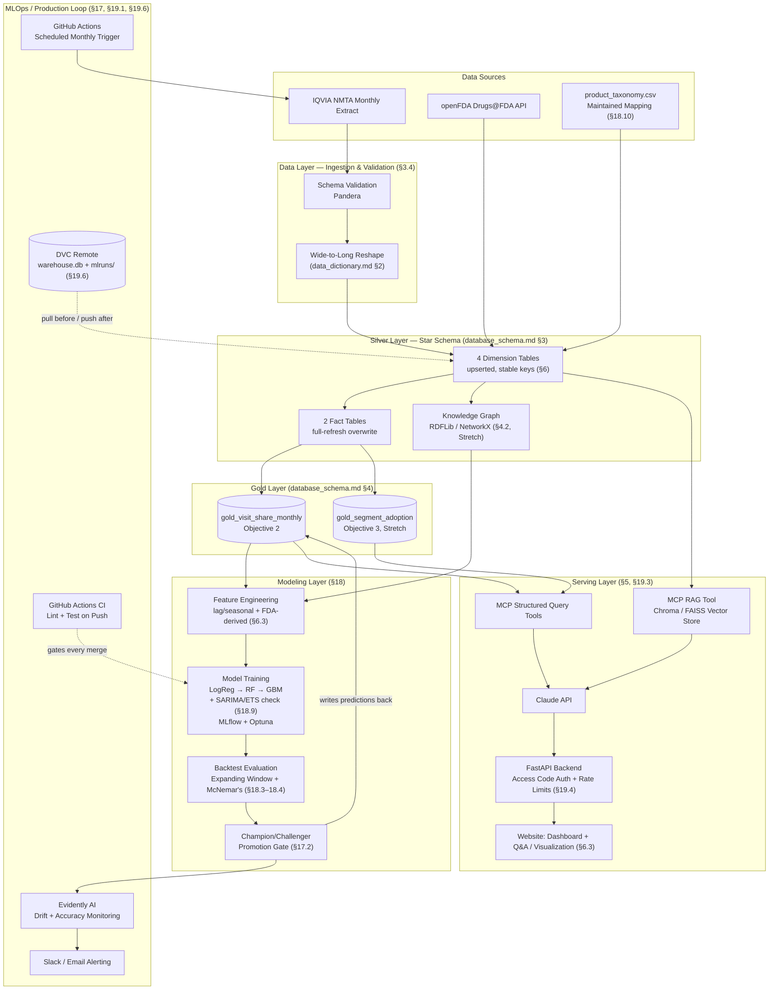

# OA & RA Market Intelligence System — Project Proposal

**Course**: DAAN 888 — Design and Implementation of Analytics System
**Program**: School of Graduate Professional Studies, Penn State University
**Term**: Fall 2026
**Team**: Tushar, Saakshaat Saini
**Revision**: Project Proposal, 6 September 2026

---

## Executive Summary

The OA & RA Market Intelligence System is an end-to-end, production-oriented classification platform that predicts monthly visit-share direction (Up / Down / Flat) between branded specialty injectables and generic pain therapies in Osteoarthritis and Rheumatoid Arthritis, built on real IQVIA NMTA patient-visit data (7.19M+ OA visits across 6 years, of which 5.32M carry a specific product record and form the basis of the visit-share calculation, see §6.1). It is designed around one stakeholder — an Injectable Brand Manager — who needs an early, defensible signal on competitive share movement before it appears in a standard quarterly business review. The system covers the complete ML lifecycle: ingestion, a monthly-refreshed gold table, a knowledge graph for competitive context, a classifier evaluated against a persistence baseline with statistical rigor, and a self-monitoring production loop that retrains monthly. The final deliverable is a public, multi-user website (open signup, access-code gated) where any brand manager can view model predictions and analytics, and ask natural-language questions or request on-demand visualizations against the gold table through Claude, connected via the Model Context Protocol (MCP) to a set of scoped, purpose-built database tools (§5, §19) — never raw SQL access. It is deliberately right-sized: real MLOps tooling (MLflow, DVC, Docker, Evidently AI, GitHub Actions scheduled jobs) chosen to fit a monthly-batch, two-person-team system rather than enterprise infrastructure the problem doesn't need.

---

## 1. Purpose & Objectives

The OA & RA Market Intelligence System is a monthly-refreshable predictive analytics platform designed to classify and monitor visit-share direction between branded specialty injectables and generic pain therapies across two disease areas — Osteoarthritis (OA) and Rheumatoid Arthritis (RA) — using IQVIA's NMTA patient-visit data. The system supports the kind of commercial decision-making an Injectable Brand Manager performs, enabling early detection of competitive shifts before they surface in standard quarterly business reviews.

### 1.1 Core Project Objectives

- **Objective 1 (Core)**: Quantify how visit share among OA treatment categories (branded injectable, generic corticosteroid, NSAID — see §18.1) has shifted over the 6-year available history and identify inflection points tied to FDA approval events. *(Confirmed via openFDA: Zilretta's FDA approval predates our Aug 2019–Jul 2025 data window (approved Oct 6, 2017, NDA208845), so no true launch inflection is observable in this data; the analysis for the branded injectable is a post-launch adoption trend instead — see §18.5.)* For RA, whose competitive structure is fundamentally different (originator biologics vs. biosimilars, not branded-vs-generic small molecules — see §6.2), the equivalent analysis is a visit-volume and originator-vs-biosimilar share trend, not the same three-category formula or a formal inflection-point test.
- **Objective 2 (Core)**: Build a classifier that predicts next month's visit-share direction (Up / Down / Flat) for the branded injectable in OA, evaluated against a persistence baseline. RA is explicitly excluded from classification (see §6.2, §10).
- **Objective 3 (Stretch)**: Classify each specialty/demographic segment as High- or Low-Adoption of the branded injectable, identifying where share is gaining fastest across both disease areas.
- **Objective 4 (Stretch)**: Build a monitoring layer that compares each month's predicted direction to actual results and automatically flags meaningful misses or accuracy drops.

### 1.2 Business Impact

Every objective is tied directly to one primary stakeholder — the OA & RA Injectable Brand Manager — and the decisions they would make differently because of this system:

- Early detection of competitive visit-share shifts 1–2 months before standard quarterly business review cycles.
- Early Up/Down/Flat signals to inform budget allocation and sales-force planning before the quarter closes.
- Segment-level adoption classification showing which specialties (orthopedic surgery, pain medicine, rheumatology, sports medicine) are gaining fastest, informing field team and marketing spend.
- Automated miss-flagging that prompts review when OA's actual visit-share direction diverges from what the classifier predicted. (RA has no classifier to compare against; its monitoring is trend-based, not prediction-based — see §6.2.)
- Comparative RA vs. OA intelligence: since RA data is sparse (M04 codes, ~1,283 visits across 6 years), the system treats OA as the primary model target and RA as a parallel exploratory/monitoring track, enabling the brand manager to contrast market dynamics across both disease areas.

**Estimated value of early detection**: if the classifier reliably flags a share decline even one quarter earlier than a standard business review would surface it, the brand team gains an extra quarter to respond, adjust field targeting, revisit pricing/contracting conversations, or reallocate marketing spend, before further share is lost. For a product at meaningful commercial scale, even a small reduction in unaddressed decline translates to material avoided revenue loss; the exact figure depends on the specific product's revenue base and is out of scope for this proposal, but the mechanism (an earlier decision point) is the system's core source of value.

---

## 2. Research & Business Questions

| # | Type | Question |
|---|------|----------|
| Q1 | Trend | How has visit share among OA and RA treatment categories shifted over the 6-year available history, and is there a detectable inflection point around branded injectable entry (corroborated by FDA approval dates)? |
| Q2 | Direction | Can a classifier reliably predict next month's visit-share direction (Up / Down / Flat) for the branded injectable in OA, and to what extent can the same framework be applied to RA? By how much does it beat a persistence baseline? |
| Q3 | Segmentation | Can specialty/demographic segments be classified as High- or Low-Adoption of the branded injectable in OA, and does adoption vary by specialty (orthopedic surgery, pain medicine, sports medicine, rheumatology)? |
| Q4 | Monitoring | How often does the OA classifier's predicted direction match actual results month to month, and what accuracy threshold should trigger a review flag? (RA has no classifier; its monitoring is limited to trend/volume review — see §6.2.) |

---

## 3. Data Sources

### 3.1 Primary Dataset — IQVIA NMTA Patient Visit Extract

The primary dataset is an IQVIA National Medical and Treatment Audit (NMTA) patient visit extract covering August 2019 through July 2025 (6 complete years). This is a commercial dataset provided for this capstone project under Penn State's data license; the raw extracts are **committed directly in this repository** (`data/raw/`) rather than gitignored, since that license covers this use.

| Field | Description |
|-------|-------------|
| Patient Visits | Monthly visit volume — the core metric for all share calculations. |
| Manufacturer & Product | Hundreds of distinct products across the OA and RA markets, including branded and generic injectables. |
| ICD-10 Scope | M15–M19 (Osteoarthritis: hip, knee, and other/unspecified sites) and M04 (Rheumatoid Arthritis: sparse). |
| Specialty × Age × Gender | 600+ column crosstab covering orthopedics, pain medicine, rheumatology, and more. |
| Place of Service | Office, Hospital, Telehealth, Other — tracked monthly. |
| Brand / Generic Tag | Four values: BRAND, GENERIC, BRANDED GENERIC, or OTHER. Reflects patent/ownership status, not therapeutic class — e.g., real NSAIDs like ibuprofen are tagged OTHER, not NSAID (see §18.1). |

### 3.2 Secondary Dataset — FDA Approval Dates

Launch dates for the branded injectable (Zilretta) and competitor products are sourced from **openFDA** (free, public API). This enables real event-based inflection-point validation rather than relying solely on visual inspection of trend charts.

### 3.3 What Is Not in the Extract (Known Gaps)

- NPA-style Rx volume, sales ($), or true market-share metrics.
- Administered vs. Prescribed distinction or Indication Approval Status.
- Geographic region or territory-level breakdown.
- Visit sequencing (times seen, days since last visit).

These gaps are acknowledged explicitly. **Visit share** is used as our proxy for market share throughout, and all reporting makes this distinction clear.

### 3.4 Data Validation Approach

Each incoming monthly extract is validated before it enters the pipeline, not just cleaned after the fact. Built as `ingestion/validation.py` (`pandera.pandas`, chosen over Great Expectations for being lighter-weight and more Pythonic, a better fit for a 2-person team): one schema per loader, checking exact column names (`strict=True`, so an extra or missing column fails rather than passing silently), the confirmed categorical values for specialty/age band/gender (§18's data-dictionary work — different valid sets for OA vs. RA, so the pivot output is validated per disease area, not against one merged list), Brand/Generic tag, Place-of-Service setting, and ICD-10 scope (M04, M15–M19). A malformed or out-of-spec extract is flagged and halted before it can silently corrupt a monthly model run, rather than being discovered downstream after a bad prediction ships.

Visit-count validity is stricter than "non-negative": the pivot and Place-of-Service schemas require **positive** integers, since both loaders already drop blank cells (§2.4, §3 of `data_dictionary.md`) — a stored zero there would mean something went wrong upstream, not that zero visits occurred. The reference table schema is the one exception, allowing zero, because a blank ICD cell is deliberately loaded as 0 there (a row's existence is the information, §4). **Not yet implemented**: automated implausible-spike detection. Today's schemas check membership and sign, not magnitude — an extract with a value 1,000× its usual size would still pass if it's a positive integer with a valid category. That is a real gap against this section's original scope, left for when the pipeline has more than one real month to compare against.

### 3.5 Data Dictionary

Field-level structure for every raw source, verified by direct inspection rather than assumed, is maintained separately in [`docs/data_dictionary.md`](data_dictionary.md): the nested Month/Manufacturer/Product pivot structure and compound column-header format (§2 of that document, including a confirmed structural difference between the OA and RA sheets' header formats), the previously undocumented Place-of-Service-by-month summary sheet present in every workbook (§3), the Brand/Generic reference table layout (§4), and the specific openFDA JSON fields consumed (§5). The ingestion pipeline (§9.4) implements against that document directly, so schema changes are tracked in one place rather than rediscovered per module.

---

## 4. Knowledge Graph & Data Warehouse Architecture

To support enriched querying, lineage tracking, and multi-domain analytics across OA and RA data, the system incorporates both a structured data warehouse layer and a knowledge graph layer.

### 4.1 Data Warehouse

The data warehouse serves as the central structured storage layer for all cleaned, transformed, and model-ready data, organized into (full DDL and field-level meaning locked in `database_schema.md` and `silver_gold_data_dictionary.md`, not repeated here):

- **Dimension Tables** (4): `dim_month`, `dim_product` (manufacturer, brand/generic tag, taxonomy-assigned treatment category, FDA approval date), `dim_specialty`, `dim_demographics`.
- **Fact Tables** (2, deliberately not one — Place of Service is a genuinely different grain, §2 of `data_dictionary.md`): `fact_product_visits` (month × product × specialty × demographic) and `fact_place_of_service_visits` (month × disease area × setting, market-level).
- **Gold Tables** (2, split by consumer objective): `gold_visit_share_monthly` (Objective 2 — one row per month) and `gold_segment_adoption` (Objective 3, Stretch — one row per month × specialty × demographic).

The warehouse is designed for a monthly-batch refresh cycle aligned with IQVIA NMTA extract delivery. DVC (Data Version Control) versions the database file (`warehouse.db`) and the model registry (`mlruns/`) so both survive between scheduled runs on an otherwise-ephemeral GitHub Actions runner (§19.6).

The two Gold tables above are what the website and the Claude+MCP query layer (§5, §19) actually read from. Each monthly run rebuilds them via a **full-refresh overwrite** (recompute from the cumulative cleaned history and replace the table), not a Slowly Changing Dimension (SCD) pattern; the reasoning, and why SCD Type 1/2 isn't warranted here, is in §19.2. Dimension tables use a different rule — upsert, not overwrite, to keep surrogate keys stable (`database_schema.md` §6).

### 4.2 Knowledge Graph

A knowledge graph layer enriches the structured warehouse data with relational context that tabular schemas cannot easily express:

- **Entity nodes**: Products, Manufacturers, Drug Classes, ICD-10 Codes (M04, M15–M19), Specialties, FDA Approval Events.
- **Relationship edges**: `is-a-branded-alternative-to`, `approved-for-indication`, `prescribed-by-specialty`, `competes-with`, `entered-market-on`.
- **Use cases**: Automated treatment-category taxonomy construction; linking FDA approval events to visit-share inflection points; enabling natural-language query interfaces over the data pipeline.

The knowledge graph is stored in a lightweight graph format (RDFLib or NetworkX, appropriate for course scope) and is queried at feature engineering time to enrich the classifier's inputs with competitive context (e.g., "how many competing branded injectables were on market in this month?").

---

## 5. AI Query & Visualization Layer: Claude + MCP

The system's natural-language query and on-demand visualization feature is served by **Claude, connected via the Model Context Protocol (MCP) to a set of scoped, purpose-built tools**, rather than a locally hosted open-source model. This section covers the rationale, the three use cases it supports, the implementation approach, and — for completeness and honesty about the trade-off actually made — the locally-hosted-LLM alternative that was seriously considered and rejected.

### 5.1 Rationale

The deciding factors, in order of how the team weighted them:

- **Reliability and answer quality at multi-user scale**: the deliverable is a public website that "any person" with an access code can query (§17.6), not a single-analyst tool. Claude's reasoning and tool-use reliability materially reduce the risk of a wrong or malformed answer reaching a brand manager, compared to a quantized 7–8B local model.
- **Engineering effort matched to a two-person team**: standing up reliable local-LLM infrastructure (quantized model serving, tool-calling reliability, uptime) is real, ongoing engineering work; API-based tool-calling is not.
- **Data governance is deliberately not the deciding factor here**: the NMTA dataset is licensed to Penn State for this project, and the team has taken ownership of the licensing question outside this document. Given that, the local-LLM's primary traditional advantage (data never leaves the premises) is not the binding constraint for this system, so it doesn't outweigh Claude+MCP's advantages on reliability and scale. This is a considered trade-off, not an oversight — see §5.5 for the alternative that was rejected and why.
- **Cost is a real, actively-managed risk, not an ignored one**: Claude is billed per request, unlike a self-hosted model's fixed compute cost. This is addressed directly through rate limiting and per-user query caps (§19.4), not left as an open risk.

### 5.2 Use Case 1 — Natural Language Query Interface

Claude answers questions in plain English by calling scoped MCP tools that query the gold table directly, e.g.:

- "Which specialty segments showed the largest OA branded injectable share gain last month?"
- "How did RA visit share compare to OA visit share in Q3 2024?"
- "When did Zilretta's share cross 5% and what happened to generic corticosteroid share in the same month?"

Every numeric or factual answer is grounded in a real tool call against the gold table, never generated from the model's own training data (§19.3, §14).

### 5.3 Use Case 2 — On-Demand Visualization Generation

A brand manager can ask for a chart in natural language (e.g., "show me Zilretta's share trend for 2024"). Claude does not generate the chart's data itself: it calls a scoped query tool to fetch the real data, produces a structured chart specification (chart type, axes, series) from the returned rows, and the website's backend renders the actual chart from that real data. This "text-to-viz" pattern prevents the LLM from ever fabricating a plausible-looking but wrong chart (§19.3).

### 5.4 Use Case 3 — Automated Narrative Reporting

After each monthly model run, Claude drafts a one-page narrative summary of the classifier's output — describing the predicted direction, the key drivers surfaced by SHAP, and any flagged monitoring alerts — using the same scoped tools. This draft is reviewed by the team before delivery to the brand manager, preserving human oversight while reducing reporting time.

### 5.5 Considered and Rejected: Locally-Hosted LLM

A locally deployed open-source model (LLaMA 3 8B or Mistral 7B, quantized 4-bit via llama.cpp, served through Ollama) was the original design in an earlier draft of this proposal, specifically for its data-governance property: proprietary data never leaves the local environment. That property is real and would matter if data confidentiality were the project's binding constraint. It was set aside in favor of Claude+MCP because, once licensing was no longer the deciding factor, local deployment's remaining costs (weaker reasoning and tool-use reliability at multi-user scale, real infrastructure/uptime engineering burden for a two-person team) outweighed its remaining benefit (cost predictability at scale, which matters less at this project's expected query volume than reliability does). This trade-off is documented here deliberately rather than silently dropped, since it was a real design decision with a real alternative, not an obvious default.

### 5.6 Implementation Approach

- **Model access**: Claude via the Anthropic API, invoked as the reasoning/orchestration layer behind the website's Q&A and visualization features.
- **Tool layer (MCP)**: a small set of purpose-built, scoped tools (e.g., `get_visit_share`, `get_top_segments`, `search_methodology`, §19.3) — never a raw SQL-execution tool — so the model's access to the database is bounded by design, not by prompting alone.
- **Backend**: FastAPI service hosting the MCP tool implementations, the website's API, and the access-code/rate-limiting layer (§19.4).
- **Database**: SQLite for course scope, with Postgres as the documented upgrade path once concurrent multi-user load exceeds SQLite's write-concurrency ceiling.

---

## 6. Dual Disease-Area Analysis: OA and RA

While OA (M15–M19) is the primary modeling target due to data volume (7.19 million visits over 6 years), the system is architected to analyze both OA and RA (M04) in parallel, providing the brand manager with comparative intelligence across both disease areas.

### 6.1 OA Analysis (Primary Track)

The OA track is the fully developed production model, including all four objectives: trend analysis, visit-share direction classification, segment adoption classification, and automated monitoring.

- **Volume**: ~7.19M total OA visits, Aug 2019 – Jul 2025, of which ~5.32M carry a specific product record and form the basis of the visit-share calculation (§18.1); the remaining ~1.87M are diagnosis-only encounters with no product recorded, not a data-loss error.
- **Market dynamics**: The branded injectable (Zilretta, 135,133 visits, the only product in its category with no generic equivalent) competing against generic-equivalent corticosteroids (Kenalog, Depo-Medrol, and 50 other products, 4.91M visits combined) and NSAIDs (54 products, 398,722 visits combined).
- **Classification target**: Monthly Up/Down/Flat direction for branded injectable share.
- **Baseline**: Persistence model (last month's direction repeated).

### 6.2 RA Analysis (Secondary/Exploratory Track)

The RA track is an exploratory parallel analysis. With only ~1,283 visits over 6 years, RA data is too sparse for a reliable monthly classifier, confirmed further by two data-level findings, not just the low volume: the RA product reference table contains **zero generic-tagged products** (all 18 entries are BRAND), and three of those products (Opdivo, Yervoy, Keytruda) are cancer immunotherapy drugs, not RA treatments at all, almost certainly miscoded under the M04 diagnosis after a checkpoint-inhibitor-related inflammatory joint side effect. RA's data isn't just small, some of it isn't RA at all. Given this, the following analyses are feasible and valuable instead of a classifier:

- **Trend analysis**: 6-year visit volume trend for RA biologic injectables by product.
- **Originator-vs-biosimilar decomposition**: unlike OA's branded-vs-generic-small-molecule dynamic, RA's real competitive structure is originator biologic vs. biosimilar (e.g., Remicade vs. its biosimilar Inflectra), reflecting a biologic-drug market rather than small-molecule generics.
- **Comparative intelligence**: Side-by-side OA vs. RA branded injectable adoption curves — useful context for a brand manager whose portfolio may span both indications.
- **Knowledge graph linkage**: RA products and approved indications are mapped in the knowledge graph, enabling the LLM to answer cross-indication queries.

RA will not have a direction classifier in the core scope due to data sparsity and the data-quality issues above, but is flagged as a future-extension case once additional months of NMTA data are collected.

### 6.3 Comparative OA vs. RA Dashboard

A dedicated dashboard panel, part of the public website (§5, §19), displays OA and RA metrics side by side, including visit share trends, branded injectable share over time, top 5 gaining specialties, and monitoring flags — for a brand manager who needs to quickly assess whether branded injectable performance is consistent across disease areas or diverging. The same panel's data is queryable in natural language through the Claude+MCP Q&A box (§5.2) and can be regenerated as an on-demand custom chart (§5.3), not just viewed as a fixed layout.

---

## 7. Project Tasks

| # | Task Category | Description | Deliverables |
|---|---------------|-------------|---------------|
| 1 | Data Collection | Receive and validate the IQVIA NMTA extract (OA + RA ICD-10 scope). Confirm with the instructor whether Rx-volume, Administered-vs-Prescribed, Approval Status, or Region data is still incoming. Retrieve FDA approval dates for all branded injectables via openFDA API. | Raw NMTA extract, openFDA records, data inventory document. |
| 2 | Data Analysis (EDA) | Explore monthly visit volume, place of service distribution, and product mix. Surface the branded-vs-generic competitive pattern in OA. Characterize RA visit data separately to confirm sparsity and set scope expectations. Build preliminary OA vs. RA comparison charts. | EDA notebook, summary statistics, preliminary visualizations. |
| 3 | Data Cleaning | Reshape the wide pivot export (600+ columns) to tidy long format. Standardize product and manufacturer names. Resolve unspecified categorical values. Separate OA (M15–M19) and RA (M04) records into distinct analytic tables. Load cleaned data into the data warehouse schema. | Cleaned long-format dataset, data warehouse tables (OA + RA fact/dim), DVC-versioned data snapshot. |
| 4 | Variable Selection & Transformation | Build the OA treatment-category taxonomy (branded injectable / generic corticosteroid / NSAID) from the Brand/Generic tag and product names (§18.1, §10). Build RA's separate originator-vs-biosimilar product mapping (§6.2), a different taxonomy reflecting RA's biologic-drug market. Engineer monthly lag features, rolling averages, seasonal indicators, and FDA event flags via the knowledge graph for OA. Document all variable definitions. | Feature engineering pipeline, variable dictionary, knowledge graph with product/FDA nodes. |
| 5 | Modelling | Build and evaluate the monthly visit-share direction classifier (Up/Down/Flat) for OA against a persistence baseline. Evaluate candidate models: logistic regression, random forest, gradient boosting (MLflow + Optuna for hyperparameter tuning). Apply SHAP for explainability. Run RA exploratory trend analysis in parallel. Integrate Claude+MCP for narrative generation. | Trained OA classifier, MLflow experiment log, SHAP plots, RA trend analysis, Claude narrative draft module. |
| 6 | Data Visualization | Build the OA trend/prediction dashboard (visit-share over time, predicted direction, SHAP drivers). Add RA panel for side-by-side comparison. Build final demo visuals. Implement automated monitoring alerts and LLM-generated summary narrative. | Interactive dashboard (OA + RA panels), monitoring alert module, final presentation visuals. |

---

## 8. Project Roadmap

| Week | Milestone | Key Activities |
|------|-----------|-----------------|
| Week 2 | Proposal Submission | Finalize proposal; confirm data receipt and scope with instructor. |
| Week 4 | Data Collection & Variables | Data inventory, EDA kickoff, variable documentation, openFDA retrieval. |
| Week 6 | Storage Plan | Data warehouse schema finalized; data cleaning pipeline complete; DVC versioning; knowledge graph entity/relationship map. |
| Week 8 | Data Cleaning Complete | Long-format reshape done; OA and RA records separated; cleaned tables loaded to warehouse. |
| Week 10 | Variable Selection & Transformation | Feature engineering pipeline complete; treatment-category taxonomy built; lag/seasonal features engineered. |
| Week 12 | Modeling & Evaluation | OA classifier trained and evaluated (MLflow); SHAP explainability; RA trend analysis; Claude+MCP query/narrative layer integrated. |
| Week 13 | Report & Visualization | Website dashboard built (OA + RA panels); monitoring alerts implemented; Claude narrative module and MCP Q&A/visualization tools tested. |
| Week 14 | Live Demo | End-to-end system demo; final report submitted; production cycle documented. |

---

## 9. Technical Architecture

### 9.1 Design Principles

The system is designed as a right-sized MLOps pipeline appropriate for a 2-person capstone team, not a scaled-down enterprise platform. Three principles apply consistently across every layer below:

1. **Fit over scale.** Every tool choice is justified against this project's actual data volume (tens of thousands of rows per monthly extract) and cadence (monthly batch, not real-time), not against what a large commercial deployment would use.
2. **Reuse before adopting.** Where an existing piece of infrastructure can do the job (e.g., GitHub Actions already runs CI, §19.1 uses it for pipeline scheduling too; the same DVC remote persists both the database and the model registry, §19.6), a new platform is not introduced just because it's the more common enterprise pattern.
3. **Grounded, auditable outputs at every boundary.** Schema validation gates data entry (§3.4), a maintained taxonomy mapping gates what category a product is assigned rather than letting the pipeline guess (§18.10), backtesting with a significance test gates model claims (§18.3–18.4), and scoped tool-calling gates what the AI layer can say (§5, §19.3) — nothing downstream is trusted to "just work" without an explicit check.
4. **Local-first.** The pipeline, database, and model training are built and validated on local machines for the bulk of the project; cloud infrastructure is stood up only once there's something ready to demo publicly, not provisioned upfront (§19.6).

### 9.2 Architecture Diagram



### 9.3 End-to-End Data Flow

Each monthly cycle moves through the diagram above in this order:

1. **Trigger**: a GitHub Actions scheduled workflow fires the pipeline monthly, aligned to NMTA's ~40-day data-lag delivery cycle (§17.1, §19.1). The runner starts by pulling the current `warehouse.db` and `mlruns/` from the DVC remote (§19.6) — it's ephemeral and holds nothing between runs otherwise.
2. **Ingest & validate**: the new NMTA extract is pulled in; Pandera schema checks run before anything downstream sees the data (§3.4). A malformed extract halts here, not three stages later.
3. **Clean & reshape**: the wide pivot export is reshaped to tidy long format and categorical values are standardized (`data_dictionary.md` §2). No taxonomy decision happens yet — that's the next stage.
4. **Silver build**: dimension tables are **upserted** (stable surrogate keys, since `gold_segment_adoption` depends on them, `database_schema.md` §6) — this is where `dim_product.treatment_category` is assigned from `product_taxonomy.csv`, with `unclassified` + a monitoring alert for a genuinely new product, or `not_applicable` for RA's out-of-scope products (§18.10). Fact tables are then full-refresh-overwritten. The knowledge graph (Stretch scope, §4.2, §18.7) is built in parallel from the same dimension data plus openFDA.
5. **Gold build**: `gold_visit_share_monthly` (Objective 2) and `gold_segment_adoption` (Objective 3, Stretch) are both rebuilt via full-refresh overwrite (`database_schema.md` §4) — these, not the Silver tables, are the only things the model and the website ever read.
6. **Feature engineering & modeling**: lag/seasonal and FDA-derived features (§6.3) are computed as part of the Gold build; candidate models are trained and tuned (MLflow + Optuna), alongside the SARIMA/ETS validation check (§18.9); the classifier is backtested using the expanding-window scheme and McNemar's test (§18.3–18.4).
7. **Promotion gate**: a retrained model ("challenger") is only promoted if it beats the current champion on the primary metric; otherwise it's logged and discarded (§17.2). Predictions are written back into `gold_visit_share_monthly`. The runner then pushes the updated `warehouse.db` and `mlruns/` back to the DVC remote (§19.6) before it's torn down.
8. **Serving**: the website's dashboard reflects the refreshed gold tables once it pulls its own copy (§19.6). When a user asks a question or requests a chart, Claude calls a scoped MCP structured-query tool (for numbers, against the gold tables) or the RAG tool (for methodology/regulatory/explanation text, against Silver-layer product/FDA data) — never both loosely, see §19.3.
9. **Monitor & alert**: Evidently AI checks the new month's actual outcome against what was predicted; a drift or accuracy-drop flag posts to Slack/email within the same run that detects it (§17.1, §17.4).
10. **Continuous integration**: independent of the monthly cycle, every push to any branch runs lint + unit tests via GitHub Actions against the real committed data (§9.5), so a broken pipeline change is caught at merge time, not at the next scheduled run.

### 9.4 Component Detail

| Component | Purpose | Key Technology | Reads From | Writes To | Repo Location (§11) |
|---|---|---|---|---|---|
| Ingestion & Validation | Load monthly NMTA extract; enforce schema before entry | Pandera, `openpyxl` | Raw extract files (`data/raw/`, git-tracked, §3.1) | Validated raw tables | `src/.../ingestion/` |
| Cleaning & Reshape | Wide-to-long pivot, categorical standardization | pandas | Validated raw tables | Tidy long-format table (`data/interim/`) | `src/.../ingestion/` |
| openFDA Client | Targeted lookup: earliest approval date per branded product (Method A, §6.3) | `requests` | openFDA API | Product → approval-date lookup | `src/.../ingestion/` |
| Silver Warehouse Builder | Upsert 4 dimension tables (stable keys); full-refresh-overwrite 2 fact tables; assign `treatment_category` via taxonomy lookup | SQLAlchemy Core, SQLite | Tidy long-format table, `data/reference/product_taxonomy.csv` | `warehouse.db` — Silver tables (`database_schema.md` §3) | `src/.../warehouse/` |
| Gold Table Builder | Aggregate to `gold_visit_share_monthly` and `gold_segment_adoption`; compute `visit_share`, lags, FDA-derived features (Method B) | SQLAlchemy Core, pandas | Silver tables | `warehouse.db` — Gold tables (`database_schema.md` §4) | `src/.../warehouse/` |
| Knowledge Graph Builder (Stretch, §18.7) | Encode product/manufacturer/FDA-event relationships | RDFLib / NetworkX | Silver `dim_product`, openFDA | Graph store | `src/.../knowledge_graph/` |
| Feature Engineering | Lag/seasonal features, KG-derived competitive context (Stretch) | scikit-learn Pipelines | Gold tables, knowledge graph | Model-ready feature matrix | `src/.../features/` |
| Model Training & Evaluation | Train/tune candidates; SARIMA/ETS validation check (§18.9); backtest with significance testing; SHAP | scikit-learn, `statsmodels`, MLflow, Optuna, SHAP | Feature matrix | Trained model artifact, experiment log (`mlruns/`, DVC-tracked, §19.6) | `src/.../models/` |
| Model Registry & Promotion | Champion/challenger gate; version the deployed model | MLflow Model Registry | Candidate + current champion metrics | Promotion decision, predictions written to `gold_visit_share_monthly` | `src/.../models/` |
| MCP Tool Server | Scoped structured-query tools (Gold tables) + RAG methodology tool (Silver/FDA/SHAP text) | Python MCP SDK | Gold tables, vector store | Tool responses to Claude | `src/.../mcp/` |
| RAG Index | Chunk and embed methodology/FDA/SHAP-explanation text | Chroma / FAISS | `docs/PROPOSAL.md`, `data_analysis_reference.md`, openFDA text, generated SHAP summaries | Vector store | `src/.../rag/` |
| Website Backend | Auth, rate limiting, orchestrates Claude + MCP calls, serves dashboard data | FastAPI | Gold tables (via MCP tools), user requests | API responses | `website/` |
| Website Frontend | Dashboard visuals, Q&A box, on-demand chart rendering | Rendered from FastAPI-served data | Backend API | Rendered pages | `website/` |
| Monitoring | Drift + accuracy tracking, alert generation | Evidently AI | `gold_visit_share_monthly` (predicted vs. actual), unmapped-product flags (§18.10) | Slack/email alert | `src/.../monitoring/` |
| Pipeline Orchestration | Ties the monthly stages together in order; DVC pull/push around the run (§19.6) | Python, GitHub Actions schedule | All of the above | Triggers each stage in sequence | `src/.../pipeline.py`, `.github/workflows/` |
| CI/CD | Lint + test gate on every push, against real committed data (§9.5) | GitHub Actions, ruff, pytest | Repository code | Pass/fail check on PR | `.github/workflows/` |

### 9.5 Technology Stack Summary

| Layer | Stage | Tools / Approach |
|-------|-------|-------------------|
| Strategy | Problem Definition | Business KPI → ML task mapping; feasibility analysis; SLA definition. |
| Data Layer | Data Ingestion | Monthly NMTA extract, committed directly (git-tracked, §3.1); openFDA API for FDA events; Pandera schema validation before entry (§3.4). |
| Data Layer | Pipeline Scheduling | GitHub Actions scheduled workflow (`on: schedule: cron`), monthly trigger; reuses CI infra already in the repo rather than adopting a new orchestration platform (§19.1). |
| Data Layer | Database Engine | SQLite + SQLAlchemy Core, one file (`data/processed/warehouse.db`); Postgres is the documented upgrade path once concurrent load requires it (`database_schema.md` §1). |
| Data Layer | Silver — Star Schema | 4 dimension tables (upserted, stable keys) + 2 fact tables (full-refresh overwrite); taxonomy assigned via `data/reference/product_taxonomy.csv`, not inferred (`database_schema.md` §3, §18.10). |
| Data Layer | Gold — Serving Tables | `gold_visit_share_monthly` (Objective 2) + `gold_segment_adoption` (Objective 3, Stretch), both full-refresh overwrite each month (`database_schema.md` §4); the only tables the model and website ever read. |
| Data Layer | Knowledge Graph | RDFLib / NetworkX; product-indication-approval entity-relationship map — Stretch scope; Core scope uses the simpler taxonomy/FDA lookup instead (§18.7). |
| Data Layer | Exploratory Analysis | Trend, distribution, and correlation checks; OA vs. RA comparative EDA. |
| Modeling | Feature Engineering | Lag/seasonal features via sklearn Pipelines; KG-derived competitive context features (Stretch). |
| Modeling | Model Development | Logistic regression → random forest → gradient boosting; MLflow + Optuna; SARIMA/ETS as a validation check, not a competing track (§18.9). |
| Modeling | Evaluation | Time-based train/test split (expanding-window backtest, §18.3); precision/recall/F1; SHAP explainability; backtesting across historical months in place of live A/B testing; McNemar's test on the paired baseline-vs-model "Down"-class correctness indicator (§18.4), not a point-estimate comparison alone. |
| Serving | AI Query & Visualization | Claude via MCP, scoped Gold-table query tools + RAG methodology tool over Silver/FDA/SHAP text (§5, §19.3); no raw SQL exposed to the model. |
| Serving | Website | FastAPI backend + dashboard frontend; open signup, access-code gated, multi-user (§17.6, §19.4). |
| MLOps / Prod | Monitoring | Drift + accuracy tracking via Evidently AI; monthly direction-vs-actual check; unmapped-product alerts (§18.10). |
| MLOps / Prod | Productionization | joblib + Docker; scheduled monthly run via GitHub Actions (not Kubernetes-scale); local-first development, cloud stood up only for the actual demo (§19.6). |
| MLOps / Prod | Persistence | `warehouse.db` and `mlruns/` both DVC-tracked against the same remote; a scheduled run pulls both before executing and pushes both after, since the GitHub Actions runner itself is ephemeral (§19.6). |
| MLOps / Prod | Iteration | Monthly retrain on real-world ground truth as new IQVIA data lands; predictions written back into `gold_visit_share_monthly` (`database_schema.md` §4.1). |
| MLOps / Prod | CI/CD | GitHub Actions: lint and run unit tests on every push against the real committed data, so a broken pipeline change is caught before it merges, not discovered at the next monthly run. |

### 9.6 Deliberately Not Used

Kubernetes, Kafka, live A/B testing, Grafana-style real-time dashboards, and a Spark-based orchestration platform (e.g., Databricks) for the monthly pipeline — none of these fit a monthly-batch, 2-person-team system operating on a modest (tens-of-thousands-of-rows-per-month) dataset, and choosing not to over-engineer is itself a deliberate design decision (§19.1).

---

## 10. Key Data Considerations

The following analytical maturity points are explicitly acknowledged before modeling begins:

- **Wide-to-long reshape required**: Data arrives in pivot-table shape (600+ demographic combination columns). Reshaping to tidy long format is a mandatory first step, not optional.
- **Visit share as market share proxy**: We have no NPA-style Rx volume or sales ($) data — only patient visit counts. This distinction is made explicit in all reporting.
- **Treatment-category taxonomy**: Branded injectable / generic corticosteroid / NSAID groupings are not pre-labeled, and the raw Brand/Generic tag alone is actively misleading here: Kenalog and Depo-Medrol are tagged BRANDED GENERIC/BRAND, the same tags used for Zilretta, yet both have real generic equivalents elsewhere in the data (e.g., Amneal's, Teva's, and Northstar Rx's triamcinolone acetonide) and so belong in the generic-corticosteroid bucket, not as branded peers to Zilretta. The taxonomy is built from the Brand/Generic tag plus manual product-name review and cross-checking for generic equivalents, not the tag alone.
- **Manufacturer-of-record changes mid-window**: Zilretta's manufacturer changed during the 6-year window (Flexion Therapeutics, later acquired by Pacira BioSciences), splitting its visits across two manufacturer labels in the raw data (11,235 + 123,898 = 135,133 combined). Grouping by (Manufacturer, Product) instead of Product name alone would understate its true share by roughly 8%; Product-name-only grouping is used throughout.
- **Row-level totals exceed printed Grand Totals — explained, not an error**: the OA Brand/Generic reference file's row-level product total (5,561,131) is ~4.5% above its own printed Grand Total (5,323,282). `Patient Visits` is a distinct count at every level, so a visit involving two products appears in both product rows; rows therefore sum to *at least* the Grand Total, never exactly to it. The same overlap appears in the monthly pivot (product rows 5,544,840 vs. Grand Total 5,308,627) and in RA (1,287 vs. 1,283). This was previously listed as an open item for the instructor/IQVIA contact; inspecting both files shows it is a property of the measure. The consequence to carry forward: product-level visit shares are shares of *product-visits*, not unique visits (§18.1; `data_dictionary.md` §2.1, §4).
- **RA data sparsity**: Only ~1,283 total visits over 6 years for M04 (RA). Confirmed as too sparse for monthly direction classification, and partly not RA-specific at all (§6.2). RA is included as an exploratory/monitoring parallel track, not a primary classification target.
- **OA as primary model target**: All core classifier development focuses on OA (M15–M19) data, with RA analysis run in parallel for comparative intelligence.
- **AI query-scope governance**: Claude only ever accesses the gold table (aggregate visit-share/prediction data) through scoped MCP tools (§5.6, §19.3), never raw IQVIA rows and never an open SQL-execution tool, so the model's access is bounded by tool design, not by prompting discipline alone.

---

## 11. Repository Structure

The repository is organized so each folder maps directly to a stage in the Technical Architecture (§9). As of Phase 1 (ingestion), `README.md`, `.gitignore`, `docs/PROPOSAL.md`, `docs/data_dictionary.md` (§3.5), and `.dvc/` (versioning config) exist; the rest is the target structure the team builds into over the course of the semester.

```
oa-market-intelligence-system/
├── .github/workflows/            # CI (lint + test on every push) + scheduled monthly pipeline run (§19.1)
├── data/
│   ├── raw/                     # git-tracked — real NMTA extracts (§3.1: covered by Penn State's data license)
│   ├── interim/                    # gitignored — reshape outputs
│   ├── reference/                  # git-tracked — product_taxonomy.csv, the maintained taxonomy mapping (§18.10)
│   └── processed/                  # DVC-tracked — model-ready tables, incl. the gold table (§19.2)
├── src/oa_market_intelligence/
│   ├── ingestion/                  # NMTA extract loader, openFDA client
│   ├── warehouse/                  # star-schema fact/dimension/gold table builders (full-refresh overwrite, §19.2)
│   ├── knowledge_graph/            # entity/relationship graph builder (RDFLib/NetworkX)
│   ├── features/                   # taxonomy, lag/season features, KG-derived context
│   ├── models/                     # baseline, classifier training, evaluation, SHAP
│   ├── mcp/                        # MCP tool implementations: structured query tools + RAG search tool (§19.3)
│   ├── rag/                        # vector store build/index over methodology, FDA, SHAP-explanation text (§19.3)
│   ├── monitoring/                 # Evidently AI drift checks, alerting
│   └── pipeline.py                 # orchestrates the monthly end-to-end run
├── notebooks/                       # EDA, reshape validation, model exploration
├── tests/                           # unit tests per module
├── website/                         # FastAPI backend + dashboard frontend, access-code auth (§5.6, §17.6, §19.4)
├── docker/Dockerfile
├── docs/
│   ├── PROPOSAL.md                 # this document
│   ├── ARCHITECTURE.md
│   ├── data_dictionary.md          # field-level raw-source structure (§3.5) — exists
│   └── MODEL_CARD.md               # intended use, training data, limitations, performance by segment
├── .dvc/                            # data versioning config
├── mlruns/                          # gitignored — MLflow local tracking store
├── .gitignore
├── requirements.txt
└── README.md
```

---

## 12. Full ML Pipeline Coverage

This section maps the project explicitly onto the standard machine learning lifecycle, to make clear the system covers the complete pipeline, not just model training.

| Standard ML Lifecycle Stage | Coverage |
|---|---|
| Business understanding | Purpose, Objectives, and named stakeholder (§1) |
| Data collection | IQVIA NMTA extract + openFDA API (§3) |
| Data storage / warehousing | Star-schema fact/dimension tables (§4.1) |
| Exploratory data analysis | Notebooks; monthly volume, place-of-service, product-mix analysis |
| Data cleaning | Wide-to-long reshape, categorical standardization (§10) |
| Feature engineering | Lag/seasonal features, treatment-category taxonomy, KG-derived competitive context (§4.2, §7) |
| Model training with baseline | Persistence baseline → logistic regression → random forest → gradient boosting (§9) |
| Evaluation | Time-based train/test split, precision/recall/F1 with class-specific focus, SHAP explainability (§9) |
| Deployment | joblib packaging + Docker containerization, scheduled monthly run (§9) |
| Monitoring | Evidently AI drift and accuracy tracking (§9) |
| Iteration / retraining | Monthly retrain cycle on real-world ground truth (§9) |
| Reproducibility / versioning | DVC (data) + MLflow (experiments/models) |
| Serving / interface | Claude+MCP natural-language query & on-demand visualization + public multi-user website dashboard (§5, §6.3, §19) |

Every stage of a complete pipeline is represented, including two stages most student (and many early-stage industry) projects skip entirely: a self-monitoring feedback loop and a serving/query interface.

---

## 13. Data Science & Machine Learning Concepts Applied

**Core statistics and machine learning**
- Supervised learning; multi-class classification (Up/Down/Flat) and binary classification (High/Low Adoption)
- Time-based train/test splitting (not random) — required for time-series data to avoid future-information leakage
- Baseline modeling — persistence baseline as the mandatory bar any model must clear
- Ensemble methods / gradient-boosted trees
- Hyperparameter tuning (Optuna) and experiment tracking (MLflow)
- Class-specific evaluation — precision/recall prioritized on the business-critical "Down" class, not overall accuracy alone
- Model explainability (SHAP)
- Class imbalance awareness (High/Low Adoption segmentation)
- Statistical significance testing on model-vs-baseline comparisons, not point estimates alone
- Backtesting across historical periods, as the substitute for live A/B testing
- Classical time-series decomposition (trend/seasonality/residual, ACF/PACF) and a SARIMA/ETS forecasting baseline, used as a validation check on the classification approach rather than a competing model (§18.9)

**Data engineering**
- Wide-to-long (tidy data) reshaping
- Star-schema data modeling — fact tables vs. dimension tables
- Data versioning (DVC) for reproducibility
- Schema/data validation (Pandera, §3.4) at ingestion, before a bad extract can enter the pipeline

**Knowledge representation**
- Entity-relationship / graph data modeling — nodes (products, manufacturers, FDA events) and typed edges (`competes-with`, `approved-for-indication`)
- Graph-derived feature engineering — deriving model features from relationships a flat table can't easily express

**Applied LLM engineering**
- Tool-calling / Model Context Protocol (MCP) — Claude answers numeric and factual questions exclusively through scoped, purpose-built database tools, never raw SQL execution, and never free generation of the answer itself (§5, §19.3)
- Retrieval-Augmented Generation (RAG), applied specifically — a separate vector-search tool grounds *narrative* answers (methodology definitions, taxonomy explanations, FDA regulatory context, SHAP-derived "why" explanations) in real source text with citations, kept deliberately distinct from the structured tool-calling path used for numbers (§19.3)
- Text-to-viz pattern — the LLM produces a structured chart specification from real query results; the backend renders the actual chart, so the model can never fabricate the underlying data (§5.3)
- Considered-and-rejected alternative, documented — local model quantization/serving (4-bit via llama.cpp/Ollama) was evaluated and set aside in favor of Claude+MCP once data governance was no longer the binding constraint (§5.5), a real architecture trade-off made explicit rather than silently dropped
- Engineering for a multi-user, pay-per-request service — rate limiting, per-user query caps, and access-code gating (§19.4) designed specifically because the serving model (Claude API) has a real per-request cost unlike a fixed-cost local model

**MLOps / production engineering**
- Containerization (Docker) for reproducible execution
- Batch inference architecture — a deliberate choice over real-time serving, matched to the monthly data cadence
- Data/concept drift monitoring (Evidently AI)
- Scoped infrastructure decisions — explicitly not using Kubernetes, Kafka, or live A/B testing, and being able to justify why each doesn't fit this system's scale
- Champion/challenger deployment pattern — a candidate model must beat the currently-deployed model, not just a static baseline, before promotion
- SLA-driven operations — concrete, stated commitments for data freshness, processing turnaround, and alerting latency
- Rollback and incident-response design — what the system does when a new model underperforms or a pipeline run fails, defined in advance, not improvised
- Access control by design — deciding who can see the data, dashboard, and model outputs as part of the architecture, not an afterthought

**Business/analytical judgment**
- Translating a business KPI into a specific ML task formulation
- Proxy-metric reasoning — using visit share as a stated, explicit substitute for market share given known data gaps
- Feasibility assessment — using data volume (7.19M vs. ~1,283 visits) to make a real scope decision between OA and RA rather than treating both identically

---

## 14. Responsible AI & Model Risk

This system informs commercial decisions, not clinical ones, and its outputs are advisory, not autonomous. The move to an open, multi-user website (§17.6, §19.4) makes this section load-bearing rather than aspirational: controls that were reasonable for a team-internal tool are not automatically sufficient once "any person" with an access code can query the system. The following controls follow from that:

- **Human-in-the-loop for LLM output**: every auto-drafted narrative summary (§5.4) is reviewed by the team before it reaches the Brand Manager. Claude drafts; it does not publish unsupervised.
- **Grounded, citable answers only**: numeric and factual answers (§5.2) come exclusively from scoped MCP tool calls against the gold table, never free generation; narrative/methodology answers (§19.3) come from the RAG layer's retrieved passages with citations back to the source document. Neither path lets the model answer from what it "remembers" instead of what a tool returned.
- **Query-scope enforcement**: the MCP tools and system prompt are scoped to advisory/commercial questions about visit-share and model output only. The system is explicitly designed to decline clinical, diagnostic, or treatment-recommendation questions, since it was never trained or validated for that use, regardless of what a user asks it.
- **Prompt-injection-resistant tool design**: because this is now a multi-user, open-signup surface, tool inputs and outputs are treated as untrusted by default — tools return structured data rather than executing arbitrary user-supplied query text (no raw SQL tool, §5.6), which removes the main injection vector rather than relying on the model to resist a malicious prompt.
- **Rate limiting and cost control as a safety control, not just a budget control**: per-user query caps (§19.4) also bound how much any single account (malicious or just misconfigured) can probe the system in a short window.
- **Explicit uncertainty communication**: the classifier's output is a prediction with a known baseline-relative accuracy, not a guarantee. Dashboard, Q&A, and narrative outputs state the model's current accuracy alongside the prediction, so the Brand Manager can calibrate how much weight to give it.

This system does not process or expose patient-identifiable information; the NMTA extract is aggregate visit-count data, not patient-level records.

**On fairness auditing, specifically**: a standard ML-lifecycle checklist calls for a formal fairness/bias audit at evaluation time, and this system doesn't have one in the traditional sense (checking for disparate outcomes across protected classes like race or gender in an individual-level decision). That's a considered scope decision, not an oversight: the classifier doesn't make or influence any decision *about* an individual person — it predicts an aggregate, market-level visit-share trend for a commercial product, computed from de-identified visit counts with no patient-level record in scope at all (§14 above). The closest analogous, genuinely useful check for *this* system is the segment-level performance breakdown already planned in the Model Card (§15) — verifying the classifier's accuracy holds consistently across specialties and demographic segments rather than degrading for a particular one — and that's the diagnostic this system actually runs, in place of an individual-fairness audit that wouldn't have a meaningful target here.

---

## 15. Model Card (Planned)

A model card (`docs/MODEL_CARD.md`) will be published alongside the trained classifier, following the standard practice established by Google and Hugging Face for documenting model behavior and limitations. It will include:

- **Intended use**: early-warning classification of OA branded-injectable visit-share direction for commercial decision support; not intended for clinical, regulatory, or patient-level use.
- **Training data**: IQVIA NMTA patient-visit extract, Aug 2019–Jul 2025, OA (M15–M19) scope; RA (M04) explicitly excluded from the trained classifier due to data sparsity.
- **Evaluation results**: accuracy/precision/recall against the persistence baseline, backtested across historical periods (populated once modeling is complete — see §16).
- **Known limitations**: visit counts as a proxy for market share; no patient-level, regional, or Rx-volume data; model reflects patterns in a single commercial dataset and may not generalize beyond it.
- **Performance by segment**: whether accuracy holds consistently across specialties and demographic segments, or degrades for any particular one.

---

## 16. Preliminary Results (To Be Completed)

Model training has not yet begun as of this proposal (Week 2). This section is structured now so results can be filled in directly as they become available, rather than assembled from scratch at the end of the project.

| Metric | Persistence Baseline | Trained Classifier | Statistically Significant? |
|---|---|---|---|
| Overall accuracy | TBD | TBD | TBD |
| Precision ("Down" class) | TBD | TBD | TBD |
| Recall ("Down" class) | TBD | TBD | TBD |
| F1 ("Down" class) | TBD | TBD | TBD |

Backtesting results across historical periods, and the High/Low Adoption segment classifier's performance, will be reported here in the same format once available (target: Week 12, per the roadmap in §8).

---

## 17. Production Operations

This section defines how the system actually operates once running, not just how it's built, the part of "production" that's easy to skip and most reveals whether a system was designed to be operated, not just demoed once.

### 17.1 Service Level Agreements (SLAs)

- **Refresh cadence**: monthly, aligned to NMTA's own ~40-day data-lag cycle.
- **Processing SLA**: the pipeline completes, end to end, within 24 hours of a new extract landing.
- **Availability definition**: for a batch system, "available" means the monthly prediction and dashboard are refreshed and reviewable before the next monthly cycle begins, not 24/7 uptime, which doesn't apply to a system with no live traffic.
- **Alerting SLA**: a divergence or accuracy-drop flag fires within the same pipeline run that detects it, never held for a manual review to discover later.

### 17.2 Deployment & Model Promotion (Champion/Challenger)

On every push to `main`, CI runs linting and unit tests (§9). When a retrained model ("challenger") is produced, it is evaluated against both the persistence baseline **and** the currently-deployed model ("champion") on the backtest set. Only if the challenger beats the champion on the primary metric (recall on the "Down" class) is it promoted to the MLflow Model Registry's `Production` stage; the next scheduled pipeline run then uses it automatically. A challenger that doesn't beat the champion is logged and discarded, the system never silently swaps in a worse model.

### 17.3 Rollback Procedure

If a newly promoted model's live monthly accuracy falls below its backtested expectation for two consecutive months, or a monitoring alert flags a significant miss, the pipeline automatically reverts to the previous `Production`-stage model in the MLflow registry while the team investigates, rather than continuing to serve a degraded model.

### 17.4 Monitoring & Alerting Channels

Drift and accuracy alerts (Evidently AI, §9) post to a dedicated Slack channel (or email distribution list for course scope) naming the specific flagged metric and its threshold, not a dashboard indicator someone has to remember to check.

### 17.5 Incident Response

If a monthly pipeline run fails (a malformed extract that fails validation, an ingestion error, etc.), the last successful prediction stays live and visible, the dashboard never goes silently blank, and the team is alerted to investigate before the next cycle runs.

### 17.6 Access Control

The website is **open signup, access-code gated**: any brand manager with a valid access code can create an account and use the dashboard and Claude+MCP Q&A/visualization features (§5, §19.4) — this is a deliberate change from an earlier, team-only access model, made to match the team's stated goal of building a reliable, scalable system for brand managers generally, not a single-user tool. Two boundaries make this safe to open up:

- **The underlying warehouse and gold table are never directly exposed.** Every user interaction, dashboard render or Claude query, goes through the FastAPI backend and its scoped MCP tools (§5.6, §19.3); no account, including a signed-up user, gets raw database or SQL access.
- **Access-code issuance and revocation stay with the project team.** Codes are the actual admission control; a compromised or abused code can be revoked without affecting other users, and issuance is tracked so usage can be tied back to an account if abuse or excessive cost is flagged (§19.4).

### 17.7 Cost & Resource Considerations

The monthly retrain and pipeline run on standard team hardware and free GitHub Actions runners (§19.1), CPU-only, no GPU required, no recurring compute cost. The one real recurring cost is the Claude API, billed per Q&A/visualization request (§5.6) — this is a deliberate, accepted trade-off (§5.1, §5.5) rather than an oversight, and it is the reason §19.4's rate limiting and per-user query caps exist: they keep that variable cost bounded and predictable rather than open-ended, which is what actually makes the system operable by a small team without a large infrastructure budget.

### 17.8 Cloud Infrastructure Footprint

The system's design keeps the raw IQVIA extract itself local and never uploaded anywhere (§3.1), but the serving layer is intentionally cloud-based, since the deliverable is a public website (§5, §19):

- **DVC remote storage (S3)**: only processed, aggregate, de-identified tables (§18.7) are pushed to a DVC-managed S3 remote for versioned, reproducible access across the team. The raw IQVIA extract stays `.gitignore`d and local, and is never uploaded anywhere, cloud or otherwise.
- **CI/CD and pipeline scheduling (GitHub Actions)**: linting and unit tests (§9) run on every push, and the monthly gold-table refresh pipeline (§19.1) runs on a GitHub Actions scheduled workflow — both on GitHub-hosted, cloud-based runners.
- **AI query layer (Claude API)**: the gold table's aggregate visit-share and prediction data (never raw IQVIA rows, §10) is sent to the Claude API when a user asks a question or requests a visualization (§5, §19.3). This is a genuine, deliberate exception to "nothing sensitive leaves the environment," made explicitly because the underlying data is licensed for this use and the team has taken ownership of that licensing question; it is documented here rather than left implicit.
- **Website hosting**: the dashboard and Q&A interface (§6.3, §19.4) are deployed to a small cloud instance (e.g., a minimal AWS/GCP/Render instance) so any access-code-holding brand manager can reach it without local infrastructure.

This is a deliberate split: the raw extract never leaves local storage, while the aggregate gold table is treated as safe to serve through cloud infrastructure and the Claude API, consistent with the licensing position stated above.

---

## 18. Precise Definitions & Core-Scope Build Decisions

The objectives, questions, and evaluation approach described above are directionally correct but were not yet precise enough to implement without ambiguity. This section resolves that before any modeling code is written, each decision below is a real design choice with stated reasoning, not a placeholder.

### 18.1 Visit-Share Target Definition (Objective 2)

The classifier's label is computed as:

```
visit_share(branded_injectable, month t) =
    patient_visits(branded_injectable, t) /
    patient_visits(branded_injectable, t) + patient_visits(generic_corticosteroid, t) + patient_visits(NSAID, t)
```

The denominator spans **all three treatment categories** (branded injectable, generic corticosteroid, NSAID) rather than injectables alone. This is deliberate: §6.1 and the Executive Summary already frame the competitive dynamic as including NSAIDs, narrowing the denominator to injectables-only would silently contradict the business framing stated elsewhere in this document.

**Source of the visit counts — decided: the monthly pivot, not the reference file.** The share is computed from the Product rows of the monthly pivot (`Team1_M15_19_OA.xlsx`). The `Branded Generic` reference file has no time dimension, so it cannot produce a monthly series; it supplies only the Brand/Generic tag and the product list. The two sources disagree slightly (e.g., Zilretta is 135,119 in the pivot vs. 135,133 in the reference file; see `data_dictionary.md` §2.4), so the choice is stated rather than left implicit. One consequence to report alongside any share: Patient Visits is a distinct count per pivot row, so a visit involving two products is counted in both, and these shares are shares of *product-visits*, not of unique visits.

Concretely, using the full OA product categorization (data-derived, not hand-typed; the category *membership* comes from the reference file's 145 products, the visit *counts* below from the pivot's Product rows over all 72 months):

- `branded_injectable` = Zilretta only (135,119 visits, the only product in this market with no generic equivalent)
- `generic_corticosteroid` = 52 products including Kenalog and Depo-Medrol (4,904,897 visits combined)
- `NSAID` = 54 products including aspirin, acetaminophen, and ibuprofen variants (394,076 visits combined)

A fourth category present in the data, opioid/other injectable analgesics (36 products in the pivot, e.g., Ketorolac, Fentanyl, 110,747 visits combined), is **deliberately excluded** from this formula: these are pain-control agents used around procedures, not part of the branded-injectable-vs-generic-corticosteroid competitive story the classifier is built around.

Resulting monthly `visit_share` ranges from 1.7% to 3.4% (median 2.5%) across the 72 months.

### 18.2 Direction Labeling Threshold ("Flat")

Month-over-month change in `visit_share` is labeled:

- **Up**: change > +1.0 percentage point
- **Down**: change < −1.0 percentage point
- **Flat**: change within ±1.0 percentage point

The ±1.0pp threshold is a stated **default**, not a verified fact. It will be checked against the real distribution of month-over-month share changes during Week 4 EDA and adjusted if needed so the three classes are reasonably balanced (a threshold that leaves "Flat" nearly empty, or nearly all months, would make the classification task degenerate). Any change to this threshold will be logged, not silently altered.

**Check performed on the real pivot data — the default fails it.** Month-over-month changes in `visit_share` range only from −0.58 to +0.68 percentage points (standard deviation 0.19). At ±1.0pp, **all 71 changes are Flat** (0 Up, 0 Down), so the classifier would have nothing to learn:

| Threshold | Up | Down | Flat | (of 71) |
|---|---|---|---|---|
| ±1.0pp (default) | 0 | 0 | 71 | degenerate |
| ±0.5pp | 1 | 1 | 69 | degenerate |
| ±0.3pp | 3 | 4 | 64 | |
| ±0.2pp | 7 | 7 | 57 | |
| ±0.1pp | 18 | 20 | 33 | balanced |

The default must change; the replacement value is **an open decision, not yet made**. It is a genuine trade-off: only a threshold near ±0.1pp yields balanced classes, but that is about half the series' own month-to-month standard deviation, so many labeled "moves" will be noise-level. A smaller threshold also raises the stakes on the significance-test caveat in §18.4, since with only ~48 backtest folds a rare Down class gives very few events to evaluate.

### 18.3 Backtesting / Walk-Forward Validation Scheme

- **Initial training window**: 24 months minimum (two full seasonal cycles) before the first out-of-sample prediction.
- **Window type**: expanding, not rolling — each new month is added to the training set rather than dropping old months, since total history is limited (72 months) and this matches how the real monthly production cycle will actually operate (§17.2).
- **Backtest folds**: walking forward one month at a time across the remaining ~48 months, retraining before each prediction, yielding ~48 paired baseline-vs-model predictions for evaluation.

### 18.4 Statistical Significance Test

**McNemar's test**, applied to the paired binary indicator of "did the baseline correctly identify a Down month" vs. "did the model correctly identify a Down month," across the ~48 backtest folds from §18.3. This is chosen specifically because it matches the proposal's own stated priority metric (recall on the "Down" class, §17.2) and is the correct test for paired predictions on the same test instances, not independent samples. Overall accuracy is reported as a secondary comparison using the same paired approach.

**Honest expectation**: with only ~48 backtest folds for a 3-class problem, and given that monthly visit-share is highly autocorrelated (making the persistence baseline a genuinely strong competitor, not a token comparison), it is entirely possible the trained model does not beat the baseline with statistical significance. That outcome is a legitimate, anticipated finding to report honestly, not a failure of the project design.

### 18.5 FDA Approval-Date Verification (Objective 1)

**Verified** via openFDA's Drugs@FDA bulk dataset (downloaded directly, not queried live): application **NDA208845**, sponsor **Pacira Pharms Inc**, original approval granted **October 6, 2017**.

This date predates our data window (Aug 2019–Jul 2025) by approximately 22 months. **Consequence**: no true launch inflection is observable for Zilretta in this data, its entire presence in our extract is post-launch. Objective 1's analysis for the branded injectable is therefore a **post-launch adoption trend**, not a before/after launch comparison. There is no fallback candidate: per §10/§18.1, Zilretta is the only branded injectable with no generic equivalent in this dataset (Category A of the OA product taxonomy), so no other product substitutes for a launch-inflection analysis.

This section previously described a to-be-verified branching decision (if within the window vs. if it predates the window); the branch is now resolved with a checked, real answer rather than an assumption.

### 18.6 Competitor Product Scope for openFDA Retrieval

FDA approval-date retrieval is bounded to **branded (non-generic) products only** — generics and NSAIDs don't have a single meaningful "launch" event driving inflection the way a new branded product does, and most NSAIDs in this market are multi-manufacturer generics with no clean approval-event narrative. The specific list of branded products to query is drawn from what's **actually present in our own data's Brand/Generic tag field**, enumerated during Week 4 EDA, not an externally guessed list. This keeps the scope grounded in what the data can actually support rather than open-ended.

### 18.7 Core-Scope Technical Simplifications

For Objectives 1–2 specifically (Core scope only):

- **Data warehouse (§4.1)**: deferred. A simple tidy long-format table (one row per month × product × specialty × age × gender × visit count) is sufficient for trend analysis and classification. The full star-schema (separate fact/dimension/aggregate tables) is not required to hit Core objectives and is reserved for when the dashboard (§6.3) or Stretch work actually needs it.
- **Knowledge graph (§4.2)**: deferred. Objective 1's FDA-event linkage only needs a simple lookup table (product → approval date), not the full RDFLib/NetworkX graph with typed relationship edges. The full graph is reserved for when Objective 3 (Stretch) needs graph-derived competitive-context features (e.g., "how many competing branded injectables were on market this month").

Both remain fully in-scope for the project overall (§4), just not on the critical path for Core Objectives 1–2, and will be built when the work that actually depends on them begins.

### 18.8 Future Extension: Experimentation Design at Scale

Live A/B testing does not apply to this system as scoped: there is exactly one real-world outcome per month for a single market, and the model itself doesn't causally affect that outcome, it predicts, it doesn't intervene. Backtesting (§18.3) is the statistically appropriate substitute, not a workaround.

If this system were extended to monitor multiple products or therapeutic areas simultaneously, each product's monthly prediction would become an independent unit, enabling a genuine between-product randomized comparison of a challenger model against the current champion (§17.2), a real, causally valid experiment at that scale. This is documented here as a stated future direction. It is **not** built, tested, or claimed as part of the current system, and should never be described as an existing capability.

### 18.9 Time-Series Validation Check (Complementary, Not a Second Modeling Track)

With 72 months of monthly data, a genuine time series, it would be a real gap not to apply classical time-series analysis. It is added specifically as a **validation check on the classification approach (Objective 2)**, not a competing or replacement modeling track — the core objective remains the Up/Down/Flat classifier evaluated in §18.3–18.4.

Two additions, both deliberately scoped small (full reasoning and detail in `docs/data_analysis_reference.md` §5.1):

- **Trend/seasonality/residual decomposition and ACF/PACF analysis** on the `visit_share` series, confirming with real numbers (not just inspection) the autocorrelation and seasonality claims the feature-engineering plan already depends on.
- **One classical forecasting model (SARIMA or Holt-Winters/ETS)** as an additional baseline, forecasting `visit_share` directly and deriving Up/Down/Flat from the forecasted change. It is evaluated through the **same** expanding-window backtest (§18.3) and McNemar's test (§18.4) as every other candidate, not a separate methodology, so it answers honestly whether the tree-based classifiers are earning their added complexity over a well-understood classical alternative.

**Deliberately not done**: a second full modeling track, or anything beyond one classical model — no LSTM or other deep sequence models. The small-dataset caution already stated for tree-based/ensemble models (§16, §18.4) applies even more strongly to a heavily parameterized SARIMA grid search on only 72 points.

### 18.10 Taxonomy Mapping as a Maintained Artifact (Handling New Products)

The branded-injectable/generic-corticosteroid/NSAID taxonomy (§10, §18.1) cannot be fully automated: assigning a new, never-before-seen product to the correct treatment category is a product-name-review judgment call, not a rule a script can reliably make — the Kenalog/Depo-Medrol finding (§10) is exactly this kind of call, and it was made by a human, not inferred from the raw tag. Since the monthly pipeline (§19.1) is meant to run unattended, this judgment call is externalized into a small, version-controlled mapping file rather than left as inline logic or, worse, silently guessed at:

- **`data/reference/product_taxonomy.csv`**: one row per (product_name, treatment_category, disease_area), maintained by the team and git-tracked — not gitignored — so changes go through the same branch/PR/CI workflow as code.
- **Pipeline behavior on a new product**: at star-schema build time (§9.4, `dim_product`), any product name present in the new monthly extract but absent from this mapping file is assigned `treatment_category = 'unclassified'` and triggers a monitoring alert (§17.4) naming the specific unmapped product. The pipeline does **not** fail the run and does **not** guess a category — it flags the gap for a human to review and add a mapping entry before the next monthly cycle.
- **`unclassified` vs. `not_applicable` — two different things, only one of which alerts.** All 15 RA products are tagged `not_applicable`, not `unclassified`: RA doesn't use this taxonomy at all (its real competitive structure is originator-vs-biosimilar, §6.2), so they've already been reviewed and correctly excluded, not overlooked. Only `unclassified` — a product nobody has reviewed yet — triggers the monitoring alert above; `not_applicable` is a deliberate, stable classification that shouldn't page anyone every month.
- **The full product taxonomy already documented in `data_analysis_reference.md` §3 (all 145 OA and 15 RA products) is this file's first snapshot, not a one-off document** — the mapping file is what the pipeline actually reads at runtime; the markdown table stays as the human-readable rationale behind each category assignment.

This follows the same principle already applied elsewhere in the system: when full automation would require a judgment call the pipeline can't reliably make, it flags and waits for a human rather than guessing — the same posture as schema validation halting on a malformed extract (§3.4) or a challenger model never auto-promoting without beating the champion (§17.2).

---

## 19. Final Deliverable: Website & AI Serving-Layer Architecture

Sections 1–18 establish the data, modeling, and MLOps design. This section specifies how the final deliverable, a public multi-user website showing predictions, analytics, and an AI Q&A/visualization feature, is actually built, end to end, month over month.

### 19.1 Monthly Pipeline & Scheduling

The monthly cycle (ingest → validate → reshape → feature-engineer → predict → refresh gold table) is triggered by a **GitHub Actions scheduled workflow** (`on: schedule`, cron), not a new orchestration platform. This was a real decision, not a default: a Spark-based platform like **Databricks** was considered and rejected, because Databricks is built for distributed, large-scale data processing, and this pipeline runs on a modest dataset (tens of thousands of visit rows per month) on a monthly, not continuous, cadence. Adopting it would mean taking on a new platform to learn, operate, and pay for (its free tier is also time/credit-limited, not a stable long-term free option) to solve a scale problem this project doesn't have — the same reasoning that already ruled out Kubernetes and Kafka (§9). GitHub Actions is free at this usage level, and it's infrastructure the project already runs (§9 CI/CD), so there is zero new platform to adopt. If the team later needs richer retry/observability behavior than a cron-triggered job provides, the documented upgrade path is a lightweight open-source orchestrator (Prefect or Dagster), not a jump straight to enterprise-scale infrastructure.

### 19.2 Gold Table: Schema & Full-Refresh Overwrite

The two Gold tables (§4.1, full DDL in `database_schema.md` §4) are the single source of truth both the classifier and the website read from. Both are rebuilt in full each month rather than updated incrementally:

- **Loading pattern — full refresh overwrite**: each monthly run recomputes both tables from the cumulative cleaned history and replaces them, rather than applying a Slowly Changing Dimension (SCD) pattern. This is the right-sized choice here: SCD Type 1/2/3 exists to track *changes to dimension attributes over time* (e.g., a product's manufacturer-of-record changing mid-window, §10), which matters for slowly-changing reference data — handled instead by upserting the Silver dimension tables (`database_schema.md` §6) — not for tables of monthly visit counts and predictions being fully recomputed anyway. Full refresh is simpler, matches the modest data volume, and DVC (§4.1, §19.6) already gives snapshot-level history if a prior month's exact table state is ever needed.
- **Schema — two tables, split by grain, not one**: `gold_visit_share_monthly` (one row per month) carries the visit-share metric (§18.1), engineered lag/rolling/FDA-derived features, and — appended by the modeling stage — the predicted direction, model version, and, once known the following month, the realized direction for monitoring (§17.2, §17.4). `gold_segment_adoption` (one row per month × specialty × demographic, Objective 3/Stretch) carries the finer-grained adoption metric a single monthly table can't. Full column-by-column detail is in `silver_gold_data_dictionary.md` §2.
- **Predictions live in the same table as the data they were computed from**, not a separate store, so the website and Claude+MCP tools query one place for both "what happened" and "what the model predicted."

### 19.3 MCP Tool Design: Structured Queries vs. RAG

Claude's access to the Gold tables is entirely through a small, fixed set of MCP tools, split deliberately into two kinds, because they answer two different kinds of questions and fail in different ways if handled wrong:

- **Structured query tools** — e.g., `get_visit_share(category, start_month, end_month)` and `get_prediction(month)` query `gold_visit_share_monthly`; `get_top_segments(metric, month)` queries `gold_segment_adoption` (Objective 3, Stretch). Each answers a numeric/factual question by executing a fixed, parameterized query against the specific Gold table it maps to, and returning real rows. There is no raw SQL-execution tool: the model can only call these specific, scoped functions, which is both a safety boundary (§14) and a reliability one, a model can't malform a query it never writes.
- **A RAG tool** (`search_methodology(query)`) answers a different class of question the Gold tables have no rows for: "what does visit share mean," "why is Zilretta categorized differently from Kenalog," "why did the model predict Up," "when was this drug approved and by whom." This tool retrieves from a small vector store (Chroma or FAISS, chosen for being free and right-sized, not a new platform) built from: chunked `PROPOSAL.md`/`data_analysis_reference.md` methodology sections (§18.1's formula, §10's taxonomy reasoning), the openFDA approval/label text already downloaded for this project (§18.5), and per-prediction SHAP explanation text generated at model-run time. Retrieved passages are returned with a citation to their source section/document, and Claude answers from those passages, not from its own training data, for exactly the reason the Kenalog/Depo-Medrol taxonomy trap (§10) showed: plausible-sounding domain knowledge can be wrong for *this specific dataset's* conventions.
- **Chart generation** (§5.3) is not a third tool type: it's a structured query tool call followed by Claude producing a chart *specification* (not chart data) from the real returned rows, which the backend renders. The model never has a path to inventing numbers that appear in either an answer or a chart.

### 19.4 Multi-User Access, Rate Limiting & Cost Control

Because the website is open signup (any brand manager, gated only by an access code, §17.6) and Claude is billed per request, the backend enforces:

- **Access-code-gated signup**: creating an account requires a valid, team-issued access code; this is the actual admission boundary, not the LLM itself.
- **Per-user rate limits and query caps**: a bounded number of Q&A/visualization requests per user per day, enforced in the FastAPI backend before a request ever reaches the Claude API, so a single account (misbehaving or malicious) cannot drive runaway API cost.
- **Usage tied to accounts, not anonymous**: every query is attributable to the account that made it, so unusual usage can be traced and a specific access code revoked (§17.6) without disrupting other users.

These controls exist specifically because the project's chosen serving model (Claude API, pay-per-request) trades a fixed local-compute cost for a variable one (§5.5); they are the concrete mechanism that makes that trade-off manageable rather than an open-ended risk.

### 19.5 End-to-End Monthly Cycle

Putting §19.1–§19.4 together, the full monthly cycle is: (1) GitHub Actions pulls `warehouse.db`/`mlruns/` from the DVC remote and triggers the pipeline on schedule (§19.6); (2) the new NMTA extract is validated, cleaned, and reshaped (§3.4, §7); (3) the Silver dimension/fact tables and both Gold tables are rebuilt via upsert/full-refresh overwrite as appropriate (§19.2, `database_schema.md` §6); (4) the classifier retrains and, if it beats the current champion, is promoted (§17.2), with its new predictions written into `gold_visit_share_monthly`; (5) the updated `warehouse.db`/`mlruns/` are pushed back to the DVC remote (§19.6); (6) the website's dashboard reflects the new month's data and predictions once it pulls its own copy, and Claude's MCP tools query the newly refreshed Gold tables for every subsequent question, no manual step required between a new extract landing and the website reflecting it.

### 19.6 Local-First Development & the Persistence Problem

**Development approach**: the pipeline, database, and model training are built and validated entirely on local machines for the bulk of the project, with cloud infrastructure (the DVC remote, the deployed website) stood up only once there's something ready to actually demo publicly — not provisioned upfront. Nothing in Phases 1–2's work (ingestion, star schema, gold tables, model training via MLflow) requires any cloud service to build or test; `warehouse.db` and `mlruns/` are both just local files on whichever machine is running the code, exactly the same as any other project file.

**Why this is safe to defer, not a shortcut**: this project has no real monthly IQVIA data arriving during the semester — one static historical extract is all there is. So "the pipeline runs automatically every month in production" is a **designed and demonstrated capability** (triggering the GitHub Actions workflow and showing it completes successfully), not something that needs to have actually been running unattended for months before it counts as done.

**The one real persistence problem this raises, and its fix**: a GitHub Actions runner is ephemeral — it's created fresh for each scheduled run and destroyed afterward, so nothing saved to its local disk survives to the next run. This affects **two** things, not just the database:

- `data/processed/warehouse.db` (the star schema + gold tables)
- `mlruns/` (MLflow's tracking store — experiment history and the registered "champion" model), which the champion/challenger promotion logic (§17.2) depends on having *last* month's result available to compare against

Both get the same fix: both are DVC-tracked, with the actual bytes persisted in a DVC remote (§17.8). A scheduled pipeline run does `dvc pull` for both at the start (fetching last month's state), does its work, then `dvc push` for both at the end (publishing the new state) — reusing the one piece of cloud infrastructure this project needs, rather than inventing a separate persistence mechanism for models versus data.

**What the delivery layer (website + MCP) needs, and where it comes from, in both the local and deployed case**:

| Component | Local development | Once deployed |
|---|---|---|
| Gold tables (`warehouse.db`) | Local file, same machine as the website | Website's host pulls its own copy via DVC after each monthly refresh (§17.8) |
| Trained model (`mlruns/`) | Local file, same machine | Same — pulled via DVC alongside the database |
| Claude API | Requires internet regardless — Anthropic's service, not self-hosted | Same, unaffected by where the website itself runs |
| openFDA API | Requires internet, but only during the pipeline run (Bronze-stage), not at serving time | Same |

The only genuinely external dependency in this whole system, even in a fully local setup, is the Claude API call itself — everything the team builds (database, models, MCP tools, website) can run entirely on local machines until there's a real reason to deploy it.
