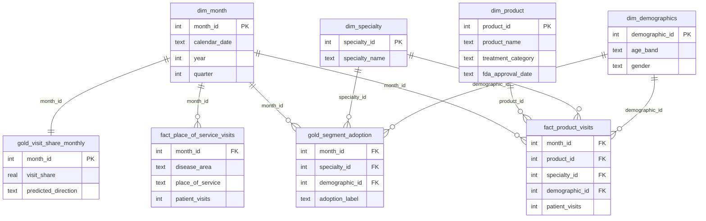

# Database Schema (DDL)

This document locks in the concrete database design decided during Phase 1 finalization: engine choice, the Silver-layer star schema, the Gold-layer serving tables, and the taxonomy reference artifact. It is the single source of truth for table structure — the pipeline code (`src/oa_market_intelligence/warehouse/`) implements against this document, not the other way around. Business/formula context lives in `PROPOSAL.md` (§4, §18, §19) and `data_dictionary.md`; this document is schema only.

---

## 1. Engine & Storage

- **Engine**: SQLite (§5.6, §9.4 of `PROPOSAL.md`). Postgres is the documented upgrade path once concurrent multi-user website load requires it — not before.
- **Access layer**: SQLAlchemy Core (not the full ORM) — schema defined once in Python, portable to Postgres via a connection-string change if that migration happens.
- **File location**: `data/processed/warehouse.db`, DVC-tracked (§11).
- **Both the Silver (star schema) and Gold tables live in this same single file** — no separate database per layer.
- **Local-first**: for development and testing, this file is just a normal local file on whichever machine runs the pipeline — no cloud service required to build or use it. DVC tracking only becomes load-bearing once the pipeline runs on an ephemeral GitHub Actions runner, which has no persistent disk between scheduled runs — see `PROPOSAL.md` §19.6 for the full persistence story, which applies identically to `mlruns/` (the MLflow model registry, §17.2).

---

## 2. Entity-Relationship Overview



---

## 3. Silver Layer — Star Schema

### 3.1 Dimension Tables

```sql
CREATE TABLE IF NOT EXISTS dim_month (
    month_id      INTEGER PRIMARY KEY,   -- deterministic natural key, YYYYMM (e.g. 201908)
    calendar_date TEXT NOT NULL,         -- ISO date, first of month: '2019-08-01'
    year          INTEGER NOT NULL,
    quarter       INTEGER NOT NULL CHECK (quarter BETWEEN 1 AND 4),
    month_number  INTEGER NOT NULL CHECK (month_number BETWEEN 1 AND 12),
    month_name    TEXT NOT NULL
);

CREATE TABLE IF NOT EXISTS dim_product (
    product_id         INTEGER PRIMARY KEY AUTOINCREMENT,
    product_name       TEXT NOT NULL UNIQUE,
    manufacturer       TEXT,                         -- informational only; never used for grouping/joins (§10)
    brand_generic_tag  TEXT NOT NULL
        -- single value per product, but the reference file carries >1 tag for 7 OA products
        -- (data_dictionary.md §4). Decided: the Silver builder resolves to the tag with the
        -- most visits for that product. 6 of the 7 resolve to OTHER by a wide margin
        -- (thousands to tens of thousands of visits vs. single/double digits); the seventh,
        -- HYDROCORTISONE, resolves to GENERIC over BRAND by 6 visits to 1 - the only close
        -- call, and immaterial given its 7-visit total. HYDROCORTISONE still gets an openFDA
        -- lookup regardless (openfda_client.branded_products() scopes off the raw reference
        -- table, not this resolved column, PROPOSAL.md §18.6)
        CHECK (brand_generic_tag IN ('BRAND','GENERIC','BRANDED GENERIC','OTHER')),
    disease_area       TEXT NOT NULL CHECK (disease_area IN ('OA','RA')),
    treatment_category TEXT NOT NULL DEFAULT 'unclassified',
        -- OA taxonomy: 'branded_injectable' | 'generic_corticosteroid' | 'nsaid_otc' | 'opioid_other'
        -- 'not_applicable': product is outside this taxonomy's scope by design (all 15 RA products —
        --   RA uses an originator-vs-biosimilar structure, §6.2, not this OA formula) — reviewed, not a gap
        -- 'unclassified': genuinely not yet reviewed — the only value that triggers a monitoring alert (§18.10)
        -- sourced from data/reference/product_taxonomy.csv (§4 below), not inferred at load time
    fda_approval_date  TEXT                          -- ISO date, nullable; openFDA Method A (PROPOSAL.md §6.3)
);

CREATE TABLE IF NOT EXISTS dim_specialty (
    specialty_id   INTEGER PRIMARY KEY AUTOINCREMENT,
    specialty_name TEXT NOT NULL UNIQUE
);

CREATE TABLE IF NOT EXISTS dim_demographics (
    demographic_id INTEGER PRIMARY KEY AUTOINCREMENT,
    age_band       TEXT NOT NULL,
    gender         TEXT NOT NULL CHECK (gender IN ('MALE','FEMALE','UNSPECIFIED')),
    UNIQUE (age_band, gender)
);
```

### 3.2 Fact Tables

```sql
CREATE TABLE IF NOT EXISTS fact_product_visits (
    month_id       INTEGER NOT NULL REFERENCES dim_month(month_id),
    product_id     INTEGER NOT NULL REFERENCES dim_product(product_id),
    specialty_id   INTEGER NOT NULL REFERENCES dim_specialty(specialty_id),
    demographic_id INTEGER NOT NULL REFERENCES dim_demographics(demographic_id),
    patient_visits INTEGER NOT NULL CHECK (patient_visits >= 0),
    PRIMARY KEY (month_id, product_id, specialty_id, demographic_id)
);

CREATE TABLE IF NOT EXISTS fact_place_of_service_visits (
    month_id         INTEGER NOT NULL REFERENCES dim_month(month_id),
    disease_area     TEXT NOT NULL CHECK (disease_area IN ('OA','RA')),  -- schema allows both;
        -- the Phase 2 Silver builder loads OA only (data_dictionary.md §3) — RA's three
        -- Place-of-Service sources disagree by an order of magnitude, and nothing in Core
        -- scope reads an RA figure yet. Not a schema restriction: an RA row is valid here
        -- whenever a real decision on which RA source to use is actually made.
    place_of_service TEXT NOT NULL CHECK (place_of_service IN ('HOSPITAL','OFFICE','OTHER','TELEHEALTH')),
    patient_visits   INTEGER NOT NULL CHECK (patient_visits >= 0),
    PRIMARY KEY (month_id, disease_area, place_of_service)
);
```

### 3.3 Indexes

```sql
CREATE INDEX IF NOT EXISTS idx_fact_product_visits_month ON fact_product_visits(month_id);
CREATE INDEX IF NOT EXISTS idx_fact_pos_visits_month      ON fact_place_of_service_visits(month_id);
CREATE INDEX IF NOT EXISTS idx_dim_product_category       ON dim_product(treatment_category);
```

---

## 4. Gold Layer — Serving Tables

Two tables, split by grain (§19.2 of `PROPOSAL.md`) — not one table serving two objectives awkwardly.

### 4.1 `gold_visit_share_monthly` — Objective 2 (core), one row per month

```sql
CREATE TABLE IF NOT EXISTS gold_visit_share_monthly (
    month_id                            INTEGER PRIMARY KEY REFERENCES dim_month(month_id),

    -- category totals (§18.1)
    branded_injectable_visits           INTEGER NOT NULL CHECK (branded_injectable_visits >= 0),
    generic_corticosteroid_visits       INTEGER NOT NULL CHECK (generic_corticosteroid_visits >= 0),
    nsaid_otc_visits                    INTEGER NOT NULL CHECK (nsaid_otc_visits >= 0),

    -- target (§18.1, §18.2)
    visit_share                         REAL NOT NULL,
    direction_label                     TEXT CHECK (direction_label IN ('Up','Down','Flat')),

    -- engineered features (data_analysis_reference.md §4.1)
    visit_share_lag_1                   REAL,
    visit_share_lag_2                   REAL,
    visit_share_lag_3                   REAL,
    visit_share_roll_3mo                REAL,
    visit_share_roll_6mo                REAL,

    -- FDA-derived features, Method B (PROPOSAL.md §6.3 / data_analysis_reference.md §6.3)
    months_since_launch                 INTEGER,
    is_post_launch                      INTEGER CHECK (is_post_launch IN (0,1)),
    competitor_count_on_market          INTEGER,
    months_since_last_competitor_event  INTEGER,

    -- market-level context, from fact_place_of_service_visits (§3.2 above)
    hospital_visits                     INTEGER,
    office_visits                       INTEGER,
    other_visits                        INTEGER,
    telehealth_visits                   INTEGER,

    -- model output, written back post-prediction (§17.2)
    predicted_direction                 TEXT CHECK (predicted_direction IN ('Up','Down','Flat')),
    prediction_probability              REAL,
    model_version                       TEXT,
    actual_direction                    TEXT CHECK (actual_direction IN ('Up','Down','Flat'))
        -- filled in the FOLLOWING month once known; feeds monitoring (§17.4)
);
```

### 4.2 `gold_segment_adoption` — Objective 3 (stretch), one row per (month, specialty, demographic)

```sql
CREATE TABLE IF NOT EXISTS gold_segment_adoption (
    month_id                  INTEGER NOT NULL REFERENCES dim_month(month_id),
    specialty_id               INTEGER NOT NULL REFERENCES dim_specialty(specialty_id),
    demographic_id             INTEGER NOT NULL REFERENCES dim_demographics(demographic_id),
    branded_injectable_visits  INTEGER NOT NULL CHECK (branded_injectable_visits >= 0),
    total_category_visits      INTEGER NOT NULL CHECK (total_category_visits >= 0),
    segment_visit_share        REAL NOT NULL,
    adoption_label             TEXT CHECK (adoption_label IN ('High','Low')),
    PRIMARY KEY (month_id, specialty_id, demographic_id)
);
```

---

## 5. Reference Artifact (not a database table)

**`data/reference/product_taxonomy.csv`** (§18.10 of `PROPOSAL.md`) — the maintained, human-reviewed mapping the pipeline reads when building `dim_product.treatment_category`. Git-tracked, not gitignored.

```csv
product_name,treatment_category,disease_area
ZILRETTA,branded_injectable,OA
KENALOG,generic_corticosteroid,OA
DEPO-MEDROL,generic_corticosteroid,OA
ASPIRIN,nsaid_otc,OA
KETOROLAC TROMETH,opioid_other,OA
ILARIS,not_applicable,RA
```

A product present in a new monthly extract but absent from this file is loaded with `treatment_category = 'unclassified'` and triggers a monitoring alert — never silently guessed (§18.10).

---

## 6. Rebuild Semantics (full-refresh-overwrite, done correctly)

§19.2 established full-refresh-overwrite as the loading pattern, but **dimension tables and fact/gold tables need different implementations of it** — this is the one place a naive "drop and recreate everything" would introduce a real bug:

- **Dimension tables (`dim_product`, `dim_specialty`, `dim_demographics`) must be upserted, not dropped and recreated.** Their surrogate keys (`product_id`, etc.) are referenced by `gold_segment_adoption`'s own primary key and by `fact_product_visits`. If a monthly rebuild reassigned surrogate keys from scratch, historical rows in the gold tables would silently point to the wrong entity, or fail their foreign keys. Pattern: for each entity in the new extract, insert if the natural key (`product_name`, `specialty_name`, or the `(age_band, gender)` pair) doesn't already exist; otherwise update its non-key attributes (e.g., a corrected `treatment_category`) in place, keeping the existing surrogate key.
- **`dim_month` is naturally safe** — its key (`month_id`, `YYYYMM`) is a deterministic natural key, not autoincrement, so it's stable by construction; new months simply get inserted, existing ones are never touched.
- **Fact tables and Gold tables can be truly full-refresh-overwritten** (`DELETE FROM ... ; INSERT ...` inside one transaction, or a drop/recreate) each cycle, since they hold no keys anything else depends on staying stable — they're the leaves of this schema, not the roots.

Implementation order each monthly run: **upsert dimensions first → then full-refresh-overwrite fact tables → then full-refresh-overwrite gold tables**, since each stage reads the previous one.
