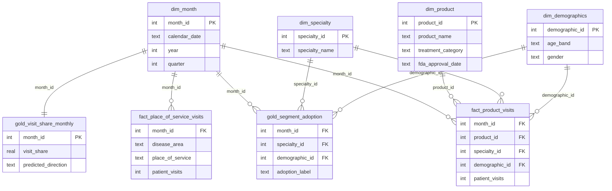

# Database Schema (DDL)

This document locks in the concrete database design decided during Phase 1 finalization: engine choice, the Silver-layer star schema, the Gold-layer serving tables, and the taxonomy reference artifact. It is the single source of truth for table structure — the pipeline code (`src/oa_market_intelligence/warehouse/`) implements against this document, not the other way around. Business/formula context lives in `PROPOSAL.md` (§4, §18, §19) and `data_dictionary.md`; this document is schema only.

---

## 1. Engine & Storage

- **Engine**: SQLite (§5.6, §9.4 of `PROPOSAL.md`). Postgres is the documented upgrade path once concurrent multi-user website load requires it — not before.
- **Access layer**: SQLAlchemy Core (not the full ORM) — schema defined once in Python, portable to Postgres via a connection-string change if that migration happens.
- **File location**: `data/processed/warehouse.db`, DVC-tracked (§11).
- **Both the Silver (star schema) and Gold tables live in this same single file** — no separate database per layer.
- **Local-first**: for development and testing, this file is just a normal local file on whichever machine runs the pipeline — no cloud service required to build or use it. DVC tracking only becomes load-bearing once the pipeline runs on an ephemeral GitHub Actions runner, which has no persistent disk between scheduled runs — see `PROPOSAL.md` §19.6 for the full persistence story, which applies identically to `mlruns/` (the MLflow model registry, §17.2).

---

## 2. Entity-Relationship Overview


```mermaid
erDiagram
    dim_month ||--o{ fact_product_visits : month_id
    dim_product ||--o{ fact_product_visits : product_id
    dim_specialty ||--o{ fact_product_visits : specialty_id
    dim_demographics ||--o{ fact_product_visits : demographic_id
    dim_month ||--o{ fact_place_of_service_visits : month_id
    dim_month ||--|| gold_visit_share_monthly : month_id
    dim_month ||--o{ gold_segment_adoption : month_id
    dim_specialty ||--o{ gold_segment_adoption : specialty_id
    dim_demographics ||--o{ gold_segment_adoption : demographic_id

    dim_month {
        int month_id PK
        text calendar_date
        int year
        int quarter
    }
    dim_product {
        int product_id PK
        text product_name
        text treatment_category
        text fda_approval_date
    }
    dim_specialty {
        int specialty_id PK
        text specialty_name
    }
    dim_demographics {
        int demographic_id PK
        text age_band
        text gender
    }
    fact_product_visits {
        int month_id FK
        int product_id FK
        int specialty_id FK
        int demographic_id FK
        int patient_visits
    }
    fact_place_of_service_visits {
        int month_id FK
        text disease_area
        text place_of_service
        int patient_visits
    }
    gold_visit_share_monthly {
        int month_id PK
        real visit_share
        text predicted_direction
    }
    gold_segment_adoption {
        int month_id FK
        int specialty_id FK
        int demographic_id FK
        text adoption_label
    }
```

---

## 3. Silver Layer — Star Schema

### 3.1 Dimension Tables

```sql
CREATE TABLE IF NOT EXISTS dim_month (
    month_id      INTEGER PRIMARY KEY,   -- deterministic natural key, YYYYMM (e.g. 201908)
    calendar_date TEXT NOT NULL,         -- ISO date, first of month: '2019-08-01'
    year          INTEGER NOT NULL,
    quarter       INTEGER NOT NULL CHECK (quarter BETWEEN 1 AND 4),
    month_number  INTEGER NOT NULL CHECK (month_number BETWEEN 1 AND 12),
    month_name    TEXT NOT NULL
);

CREATE TABLE IF NOT EXISTS dim_product (
    product_id         INTEGER PRIMARY KEY AUTOINCREMENT,
    product_name       TEXT NOT NULL UNIQUE,
    manufacturer       TEXT,                         -- informational only; never used for grouping/joins (§10)
    brand_generic_tag  TEXT NOT NULL
        -- single value per product, but the reference file carries >1 tag for 7 OA products
        -- (data_dictionary.md §4). Decided: the Silver builder resolves to the tag with the
        -- most visits for that product. 6 of the 7 resolve to OTHER by a wide margin
        -- (thousands to tens of thousands of visits vs. single/double digits); the seventh,
        -- HYDROCORTISONE, resolves to GENERIC over BRAND by 6 visits to 1 - the only close
        -- call, and immaterial given its 7-visit total. HYDROCORTISONE still gets an openFDA
        -- lookup regardless (openfda_client.branded_products() scopes off the raw reference
        -- table, not this resolved column, PROPOSAL.md §18.6)
        CHECK (brand_generic_tag IN ('BRAND','GENERIC','BRANDED GENERIC','OTHER')),
    disease_area       TEXT NOT NULL CHECK (disease_area IN ('OA','RA')),
    treatment_category TEXT NOT NULL DEFAULT 'unclassified',
        -- OA taxonomy: 'branded_injectable' | 'generic_corticosteroid' | 'nsaid_otc' | 'opioid_other'
        -- 'not_applicable': product is outside this taxonomy's scope by design (all 15 RA products —
        --   RA uses an originator-vs-biosimilar structure, §6.2, not this OA formula) — reviewed, not a gap
        -- 'unclassified': genuinely not yet reviewed — the only value that triggers a monitoring alert (§18.10)
        -- sourced from data/reference/product_taxonomy.csv (§4 below), not inferred at load time
    fda_approval_date  TEXT                          -- ISO date, nullable; openFDA Method A (PROPOSAL.md §6.3).
        -- Populated only where treatment_category = 'branded_injectable' (today: Zilretta
        -- only) - nothing downstream reads any other product's date yet
        -- (data_analysis_reference.md §6.2). NULL elsewhere means "not queried", not "not found".
);

CREATE TABLE IF NOT EXISTS dim_specialty (
    specialty_id   INTEGER PRIMARY KEY AUTOINCREMENT,
    specialty_name TEXT NOT NULL UNIQUE
);

CREATE TABLE IF NOT EXISTS dim_demographics (
    demographic_id INTEGER PRIMARY KEY AUTOINCREMENT,
    age_band       TEXT NOT NULL,
    gender         TEXT NOT NULL CHECK (gender IN ('MALE','FEMALE','UNSPECIFIED')),
    UNIQUE (age_band, gender)
);
```

### 3.2 Fact Tables

```sql
CREATE TABLE IF NOT EXISTS fact_product_visits (
    month_id       INTEGER NOT NULL REFERENCES dim_month(month_id),
    product_id     INTEGER NOT NULL REFERENCES dim_product(product_id),
    specialty_id   INTEGER NOT NULL REFERENCES dim_specialty(specialty_id),
    demographic_id INTEGER NOT NULL REFERENCES dim_demographics(demographic_id),
    patient_visits INTEGER NOT NULL CHECK (patient_visits >= 0),
    PRIMARY KEY (month_id, product_id, specialty_id, demographic_id)
    -- This grain deliberately excludes manufacturer (dim_product resolves one manufacturer
    -- per product for display only). A single product is routinely sold under several
    -- manufacturers within the same month/specialty/demographic slice in the raw NMTA
    -- pivot (one real slice spans 13 manufacturers), so the Silver builder SUMS
    -- patient_visits across manufacturer to collapse raw rows onto this grain. Verified
    -- exact (no visits lost or double-counted) against the full real dataset: total
    -- patient_visits is unchanged by the collapse, 5,546,090 before and after.
);

CREATE TABLE IF NOT EXISTS fact_place_of_service_visits (
    month_id         INTEGER NOT NULL REFERENCES dim_month(month_id),
    disease_area     TEXT NOT NULL CHECK (disease_area IN ('OA','RA')),  -- schema allows both;
        -- the Phase 2 Silver builder loads OA only (data_dictionary.md §3) — RA's three
        -- Place-of-Service sources disagree by an order of magnitude, and nothing in Core
        -- scope reads an RA figure yet. Not a schema restriction: an RA row is valid here
        -- whenever a real decision on which RA source to use is actually made.
    place_of_service TEXT NOT NULL CHECK (place_of_service IN ('HOSPITAL','OFFICE','OTHER','TELEHEALTH')),
    patient_visits   INTEGER NOT NULL CHECK (patient_visits >= 0),
    PRIMARY KEY (month_id, disease_area, place_of_service)
);
```

### 3.3 Indexes

```sql
CREATE INDEX IF NOT EXISTS idx_fact_product_visits_month ON fact_product_visits(month_id);
CREATE INDEX IF NOT EXISTS idx_fact_pos_visits_month      ON fact_place_of_service_visits(month_id);
CREATE INDEX IF NOT EXISTS idx_dim_product_category       ON dim_product(treatment_category);
```

---

## 4. Gold Layer — Serving Tables

Two tables, split by grain (§19.2 of `PROPOSAL.md`) — not one table serving two objectives awkwardly.

### 4.1 `gold_visit_share_monthly` — Objective 2 (core), one row per month

```sql
CREATE TABLE IF NOT EXISTS gold_visit_share_monthly (
    month_id                            INTEGER PRIMARY KEY REFERENCES dim_month(month_id),

    -- category totals (§18.1)
    branded_injectable_visits           INTEGER NOT NULL CHECK (branded_injectable_visits >= 0),
    generic_corticosteroid_visits       INTEGER NOT NULL CHECK (generic_corticosteroid_visits >= 0),
    nsaid_otc_visits                    INTEGER NOT NULL CHECK (nsaid_otc_visits >= 0),

    -- target (§18.1, §18.2)
    visit_share                         REAL NOT NULL,
    direction_label                     TEXT CHECK (direction_label IN ('Up','Down','Flat')),

    -- engineered features (data_analysis_reference.md §4.1)
    visit_share_lag_1                   REAL,
    visit_share_lag_2                   REAL,
    visit_share_lag_3                   REAL,
    visit_share_roll_3mo                REAL,
    visit_share_roll_6mo                REAL,
    -- Rolling windows END AT THE PREVIOUS MONTH (visit_share.shift(1).rolling(n).mean()), so they never include
    -- the month being predicted; NULL for the first n months. (An earlier build included the current month,
    -- leaking the target; fixed - see notebooks/02_eda_cleaned_data.ipynb §9.)

    -- FDA-derived features, Method B (PROPOSAL.md §6.3 / data_analysis_reference.md §6.3)
    months_since_launch                 INTEGER,
    is_post_launch                      INTEGER CHECK (is_post_launch IN (0,1)),
    competitor_count_on_market          INTEGER,
    months_since_last_competitor_event  INTEGER,

    -- market-level context, from fact_place_of_service_visits (§3.2 above)
    hospital_visits                     INTEGER,
    office_visits                       INTEGER,
    other_visits                        INTEGER,
    telehealth_visits                   INTEGER,

    -- model output, written back post-prediction (§17.2)
    predicted_direction                 TEXT CHECK (predicted_direction IN ('Up','Down','Flat')),
    prediction_probability              REAL,
    model_version                       TEXT,
    actual_direction                    TEXT CHECK (actual_direction IN ('Up','Down','Flat'))
        -- filled in the FOLLOWING month once known; feeds monitoring (§17.4)
);
```

### 4.2 `gold_segment_adoption` — Objective 3 (stretch), one row per (month, specialty, demographic)

```sql
CREATE TABLE IF NOT EXISTS gold_segment_adoption (
    month_id                  INTEGER NOT NULL REFERENCES dim_month(month_id),
    specialty_id               INTEGER NOT NULL REFERENCES dim_specialty(specialty_id),
    demographic_id             INTEGER NOT NULL REFERENCES dim_demographics(demographic_id),
    branded_injectable_visits  INTEGER NOT NULL CHECK (branded_injectable_visits >= 0),
    total_category_visits      INTEGER NOT NULL CHECK (total_category_visits >= 0),
    segment_visit_share        REAL NOT NULL,
    adoption_label             TEXT CHECK (adoption_label IN ('High','Low')),
    PRIMARY KEY (month_id, specialty_id, demographic_id)
);
```

---

## 5. Reference Artifact (not a database table)

**`data/reference/product_taxonomy.csv`** (§18.10 of `PROPOSAL.md`) — the maintained, human-reviewed mapping the pipeline reads when building `dim_product.treatment_category`. Git-tracked, not gitignored.

```csv
product_name,treatment_category,disease_area
ZILRETTA,branded_injectable,OA
KENALOG,generic_corticosteroid,OA
DEPO-MEDROL,generic_corticosteroid,OA
ASPIRIN,nsaid_otc,OA
KETOROLAC TROMETH,opioid_other,OA
ILARIS,not_applicable,RA
```

A product present in a new monthly extract but absent from this file is loaded with `treatment_category = 'unclassified'` and triggers a monitoring alert — never silently guessed (§18.10).

---

## 6. Rebuild Semantics (full-refresh-overwrite, done correctly)

§19.2 established full-refresh-overwrite as the loading pattern, but **dimension tables and fact/gold tables need different implementations of it** — this is the one place a naive "drop and recreate everything" would introduce a real bug:

- **Dimension tables (`dim_product`, `dim_specialty`, `dim_demographics`) must be upserted, not dropped and recreated.** Their surrogate keys (`product_id`, etc.) are referenced by `gold_segment_adoption`'s own primary key and by `fact_product_visits`. If a monthly rebuild reassigned surrogate keys from scratch, historical rows in the gold tables would silently point to the wrong entity, or fail their foreign keys. Pattern: for each entity in the new extract, insert if the natural key (`product_name`, `specialty_name`, or the `(age_band, gender)` pair) doesn't already exist; otherwise update its non-key attributes (e.g., a corrected `treatment_category`) in place, keeping the existing surrogate key.
- **`dim_month` is naturally safe** — its key (`month_id`, `YYYYMM`) is a deterministic natural key, not autoincrement, so it's stable by construction; new months simply get inserted, existing ones are never touched.
- **Fact tables and Gold tables can be truly full-refresh-overwritten** (`DELETE FROM ... ; INSERT ...` inside one transaction, or a drop/recreate) each cycle, since they hold no keys anything else depends on staying stable — they're the leaves of this schema, not the roots.

Implementation order each monthly run: **upsert dimensions first → then full-refresh-overwrite fact tables → then full-refresh-overwrite gold tables**, since each stage reads the previous one.

**Open tension, not yet resolved (no modeling stage exists yet to force the issue):** `gold_visit_share_monthly`'s `predicted_direction`/`prediction_probability`/`model_version`/`actual_direction` columns are documented (`silver_gold_data_dictionary.md` §2.1) as written by the modeling stage *after* a prediction run — a separate process from the Gold builder. But this section says Gold tables are `DELETE`+`INSERT`'d wholesale every cycle. As implemented today (`warehouse/build_gold.py`), those four columns are always written `NULL`, which is correct for now since no modeling stage exists to have written anything else. Once one does, a later Silver→Gold rebuild as written today would silently wipe any predictions already recorded, unless a future change either (a) runs the modeling write-back strictly after every Gold rebuild each cycle, or (b) has the Gold builder preserve those four columns for `month_id`s that already have a non-`NULL` value. Flagged here rather than guessed at now.

**Resolved (Step 14, DL-58):** option (a). The publish step rebuilds Gold first and then writes the served direction classifier's backtest predictions into those four columns, inside the staging file before the atomic swap, so a rebuild never wipes them. The publish step also stores two key-value tables outside the star schema, `serving_model_panel` (the direction panel) and `serving_results` (`findings`, `segment_model`, `forecast`, `direction`, `monitoring`, each with its precision and build time), which the website and the Claude tools read; they are rebuilt on every publish.

## 7. External data (separate database)

The public datasets added under DL-59 live in a **second SQLite file**, `data/processed/external.db` (git-ignored), defined in `src/oa_market_intelligence/external/schema.py` with its own metadata. It shares no table with the warehouse above and is never created or altered by `create_schema` or the pipeline. 27 tables: conformed dimensions and bridges, ten `fact_ext_*` fact tables, six `gold_ext_*` tables, a download catalogue and a run log. Four tables stay local (the NPI-level provider fact, county-level prevalence, the NUCC taxonomy text and the run log); the rest are copied into the published database by the publish step. Tables join to this warehouse by natural keys (month `YYYYMM`, specialty name, two-letter state). Every column, with its source file, original column and rule, is in [`external_data_lineage.md`](external_data_lineage.md).

The six `gold_ext_*` tables are filled by `PYTHONPATH=src python -m oa_market_intelligence.external.analysis` (steps 6a to 6c: specialty triangulation, state adoption, monthly promotion with the IQVIA share, quarterly price ratio, company sales against IQVIA visits, and `gold_ext_verdicts`, which keeps one row per rule under each run id and is never overwritten). Results: [`external_data_results.md`](external_data_results.md).

## 8. Source availability (R1)

`dim_source_availability` (14 rows, one per data source) says when each source could have been known, so a model never uses a value that was not public yet. It sits in the IQVIA warehouse and is reloaded on every pipeline run from `data/reference/source_availability.csv` (the source of truth; an invalid file stops the run).

| Column | Meaning |
|---|---|
| `source_id` (key), `dataset`, `stored_in` | The source, its name, and the tables that hold it (comma-separated; "not loaded" for the optional files). |
| `period_grain`, `period_covered` | month, quarter, year, event or snapshot, and the span held. |
| `rule_type` and its numbers | `lag_months` (period end plus a lag; negative means known before the period ends), `release_year_lag` (the period's year plus N years, in `release_month`), `per_record_date` (the record's own date) or `snapshot_date` (one `fixed_month` for every period). |
| `basis` | **documented**: every period's date comes from the files we hold (SEC filing dates, event dates, the registry snapshot). **assumed**: a rule applied from anchor points or project documents (all the others). |
| `evidence`, `revision_note`, `leakage_note` | What supports the rule, whether the values we hold are later revisions, and what could leak. |

The rule is applied by `oa_market_intelligence.availability.available_from_month(rule, period_end_month, record_date=None)`, which returns the first month (YYYYMM) a value could have been known, and `is_available(rule, period, as_of_month=...)`. Tests keep the documented claims true against the committed download manifest (for example, every Part B and Part D file name says release year = data year + 2) and check that every table a model could read is covered by a source row.

**What it shows.** Medicare provider files are known about two years after the data year, Open Payments in June of the next year (and the files we hold include later corrections), the registry only from its September 2026 snapshot, and company filings and events on their own dates. For IQVIA, if the assumed lag of about 40 days holds (PROPOSAL 19.1), month *t* is known around the 10th of month *t*+2, so a forecast of month *t* made from data through *t*-1 is made after month *t* has ended. The evaluation is unchanged (it predicts month *t* from data through *t*-1); what changes is what "next month" means to a reader.

## 9. IQVIA ingest audit (R5)

`bronze_ingest_files` records what was ingested from the raw IQVIA extracts in the latest pipeline run: one row per parsed output of each raw file (six rows: the OA and RA pivot, the OA and RA place-of-service sheets, the OA and RA reference tables). It is replaced on every run; the history lives in the publish run log (`data/published/run_log.jsonl`), whose entries carry the same file hashes, so any published database can be traced to the exact extracts that produced it.

| Column | Meaning |
|---|---|
| `file_name`, `role` (key) | The raw file and what was parsed from it: `nmta_pivot`, `place_of_service` or `reference_table`. A workbook appears under two roles. |
| `disease_area` | OA or RA. |
| `sha256`, `size_bytes` | The file's content hash and size. |
| `rows_parsed`, `first_month`, `last_month`, `n_months` | Rows the parser produced and the month span (YYYYMM; blank for the reference tables, which have no months). |
| `visits_sum` | The sum of `patient_visits` over the parsed rows. It is **not** a Grand Total: visits are distinct counts, so rows overlap (the pivot's Grand Total is reconciled by the parser itself). Useful for spotting a changed extract between runs. |
| `parser_checks` | Which checks the parser had already passed before the row was recorded (Grand Total reconciliation, manufacturer subtotals, known place-of-service labels...). |
| `ingested_at` | UTC time of the run. |

The run log entry for a successful publish carries `ingest_files` (file, role, SHA-256, size, rows parsed), and the monthly job summary lists each extract with a hash prefix. Tests check the real run: six rows, hashes equal to the real files' hashes, row counts equal to `ingest`'s.

## 10. Data-quality report (R3)

`dq_report` holds the data-quality checks of the latest pipeline run (one row per check: `check_id`, `severity`, `status`, `observed`, `expected`, `note`, `checked_at`). The checks (`src/oa_market_intelligence/quality.py`) run after the per-row validation and before anything is built, and look at the extract as a whole:

| Check | Severity | What it asks |
|---|---|---|
| `month_continuity` | **error** | Are the months consecutive from the first to the last, with none missing? |
| `disease_areas_present` | **error** | Are OA and RA both in the visits and in the reference table? |
| `new_specialties`, `new_products`, `new_age_bands`, `new_genders`, `new_place_of_service` | warning | Is every category already in the baseline? New ones are named. |
| `visits_per_month_in_range`, `rows_per_month_in_range` | warning | Is each month's volume between 0.5 times the lowest and 1.5 times the highest month in the baseline, per disease area? |
| `pos_months_match_visit_months` | warning | Do the place-of-service and visit extracts cover the same months? |
| `history_restated` | warning | After the Gold build: did any month's branded, generic or NSAID visits move by more than 0.5% since the previous published database? New months are not a restatement. |

**Policy.** An error stops the run before the database is built, so the last good published database stays live. A warning is recorded in the table, in the publish run log (`quality`: counts and the warning notes) and in the monthly job summary, and the run goes on. A check that cannot run (no baseline, no previous database) is `skipped`, never `pass`.

**The baseline** `data/reference/iqvia_baseline.json` holds the categories and the monthly ranges of the extracts profiled so far (generated from the real extracts, 201908 to 202507: 50 specialties, 158 products, 10 age bands, 3 genders, 4 places of service). Regenerate it on purpose with `python -m oa_market_intelligence.quality --write-baseline`; a changed baseline is a visible diff in review. The tolerances (0.5, 1.5 and 0.5%) are in that file and are judgement calls, not tuned to results. Real run on the committed extracts: all 11 checks pass or are skipped.

## 11. The ML-ready layer (R2)

Two tables, built on every pipeline run from the committed public subset (`data/published/external_subset.db`, exported by `python -m oa_market_intelligence.external.export`) and the availability rules of R1 (`dim_source_availability`). A fresh clone needs neither the raw files nor the local external database.

| Table | Grain | What it holds |
|---|---|---|
| `mart_signal` | series x specialty group x period | Every usable outside value with `period_start_month`, `period_end_month`, `value` and **`available_from_month`**, the first month it could have been known. `specialty_group` is empty for a series with no specialty. |
| `mart_signal_asof` | IQVIA month x series x specialty group | For each IQVIA month *t*, the latest value of each series known as of the end of month *t*-1 (the rule the IQVIA features already follow), with `as_of_month`, the source period, when it became known and its age in months (negative when a value was known ahead of its period, such as a price schedule). A table constraint refuses a row known after its as-of month. |

**Series (12):** ASP price (J3304 and J3301 limits per mg, and their ratio), Open Payments promotion (physicians paid, practitioners paid, total amount, records), company net sales (known on the filing date of the cited 10-Q or 10-K), events per month, and Medicare adoption by specialty group (adoption rate, visible providers, Zilretta providers).

**A model reads `mart_signal_asof`, never `mart_signal`.** `mart.wide()` gives one row per month and one column per series (`signal` or `signal|specialty group`) for modelling. `leakage_violations` is the test: no row may have been known after its as-of month. The pipeline refuses a build that fails it, and the tests include a planted future value that must be caught.

**Left out on purpose:** anything computed from IQVIA's own visits (the IQVIA share in the promotion table, IQVIA's adjusted share in the specialty table, the sales-versus-visits table), because it would put the target into the inputs; the pooled 2020 to 2024 Medicare rate, which needs 2024 data; state-level results, which have no key to join to IQVIA; and the NPI-level data.

**What the real build shows (72 IQVIA months, 1,603 as-of rows, no violations):**

| Series | Months with a value known | Average age of that value |
|---|---|---|
| ASP price | 72 of 72 | known a month ahead |
| Company net sales | 72 of 72 | 3 months |
| Events | 72 of 72 | 8.6 months |
| Open Payments promotion | 61 of 72 | 11.4 months |
| Medicare adoption by specialty | 31 of 72 | 28.9 months |

So only price and company sales are fresh enough to be useful month by month; promotion and Medicare adoption would be heavily lagged features, absent for the first part of the series.

