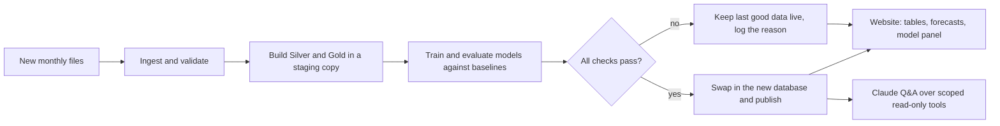

# Final Deliverable Plan

**Due: end of October 2026.** Written 6 Oct 2026. Decisions behind it: [`decision_log.md`](decision_log.md) Part G (DL-28 to DL-33, PD-09 to PD-12).

## What the course requires

A **deployed data pipeline and MLOps pipeline**, with a **public analytics website** where users can look at the tables and ask a **Claude-powered question box** about the modeling and the analytics. When new data arrives, the whole pipeline reruns, handles errors, and updates the website's tables. It is an ML pipeline project, so **real trained models** run inside it. A live new-data arrival is not demonstrated; robustness is proven by automated tests.

## How it fits together

The website always reads the last published, fully checked database. A failed run never shows half-updated numbers; it shows a banner with the reason.

## Where we stand (updated 8 October 2026)

| Piece | Status |
|---|---|
| Ingest, validate, Silver, Gold, features, evaluation harness, baselines | Built and tested (455 tests, CI on every change) |
| Rerun on new data | **Built:** a publish step builds the warehouse in a staging file, checks it, runs a model evaluation, swaps it in atomically and writes a run log; the monthly workflow runs it and commits the result. Tested for a crash in the pipeline, a crash in the model stage, a shrinking rebuild, an empty rebuild and a new month |
| Models and a rule for which one serves | **Built and tested in library code and notebooks** (Phase 4: see below and [`phase4_results.md`](phase4_results.md)). **Not yet in the publish step:** only the direction panel is computed there today (Step 14) |
| Website, Claude Q&A, access code and spend limits | **Built** (Streamlit site, four read-only aggregate tools, access code, rate limits, token budget) and tested with a scripted client. **Not deployed:** it needs the API key, the hosting account and the domain redirect (`docs/deployment.md`) |
| Monitoring | Tools built and tested (a review threshold for the direction classifier; an interval alarm for the forecast, with stated blind spots). Not yet called by the publish step (Step 14) |

## The trained models (as built)

| Task | Models | Compared against | Serves (result) |
|---|---|---|---|
| Segment share next month (Task A) | Logistic regression, gradient boosting, random forest | Market share, last month's share, the segment's and the specialty's history | **Logistic regression** (all three beat the best baseline modestly; indistinguishable, so the simplest serves) |
| Overall share forecast (Task B) | ETS (damped, and damped seasonal), ridge | "Same as last month", same month last year | **"Same as last month"** (no trained model beats it), with prediction intervals |
| Monthly direction (Up / Flat / Down) | Logistic regression, random forest, gradient boosting | Majority, persistence, seasonal rule, chance band | **The seasonal rule** (no trained model clears the bar; a power statement says what 35 test months could detect) |

Every model is scored out of time with confidence intervals, and a rule fixed in advance decides what serves. The site shows the evidence either way. XGBoost, SHAP and MLflow were not used (cut list; none installed).

## Milestones

| | Dates | Goal | Done when |
|---|---|---|---|
| **M1** | 7 to 13 Oct | **A safe, rerunnable pipeline with the ML stage.** No hosting needed. | One command runs the data stage and the ML stage; the new database is built beside the old one and swapped in only if every check passes; a run log records each run; failure tests pass (malformed file, a month missing, an outside-service outage); a simulated-new-month test passes (data to June, then to July: tables update, rerun is idempotent); models trained and tracked; the serving rule works; all of it runs in CI. |
| **M2** | 14 to 20 Oct | **A deployed thin slice.** Hosting and budgets decided on 14 Oct (Q-07). | A public URL shows one table with its "as of" date and last-run status; a Claude question box answers questions about that table only; an access code and a spend cap are on; the publish workflow makes the site pick up a new database file. |
| **M3** | 21 to 27 Oct | **Widen and harden.** | Market trend and share forecast with ranges; segment gap table; a model panel with baselines, intervals and the honest verdict; data-quality notes; run history; Claude tools over every table; a set of test questions with expected answers; guardrail tests (no raw rows, no open SQL, off-topic and prompt-injection refusals); basic data-quality and drift checks; cost limits verified. |
| **M4** | 28 to 31 Oct | **Rehearse and buffer.** No new features after 28 Oct. | A clean-checkout dry run end to end; README, model card and decision log updated; refreshed slide deck and script; demo script; fix list cleared. |

**Status note (8 October 2026):** the dates above were a first draft. The owner set a target of version 1 live by 15 October (DL-34) and Phase 4 modeling is finished; what remains is the deployment (the owner's accounts and secrets), the Step 14 integration of the Phase 4 results into the publish step and the site, and a later round of improvement with extra data (DL-57). The cut list below is unchanged.

## Cut list, in this order, if time runs short

1. Sign-up and accounts (use one shared access code).
2. RAG over the methodology documents.
3. The knowledge graph.
4. SHAP explanations.
5. Drift tooling beyond a simple custom check.
6. XGBoost.

**Not cut:** the deployed site, the Claude question box, the safe rerun, and at least one trained model served with its honest evaluation.

## Risks

- **Time.** About three and a half weeks. The thin-slice-first order exists to find the hard problems early.
- **Cost and abuse of a public Claude endpoint.** Access code, per-user limits and a hard monthly cap, all tested.
- **Free hosts that sleep when idle**, and a database file that must be swapped safely on the host. Settled at the 14 Oct decision.
- **Models may not beat their baselines.** If so, the site says so; that is the designed behavior, not a failure.
- **Only 72 months of data**, so any "new month" in tests is simulated.
- **Data shown publicly is aggregate only.** No raw rows, on the site or to Claude (DL-07, DL-30).
- **Secrets.** The Claude key stays server-side and is never committed.

## Decisions still needed

| Decision | Status |
|---|---|
| Hosting platform; Claude API budget and monthly spend cap; one shared access code or open access (Q-06, Q-07) | **Open.** Streamlit Community Cloud is the first choice; the owner creates the key (with a spend limit) and the app; steps in `docs/deployment.md` |
| ETS or SARIMA for the forecast (Q-05) | **Resolved:** ETS, and it does not beat "same as last month" (DL-40, DL-53) |
| Whether the segment model, the forecast or both are served (Q-08) | **Resolved:** the segment model serves (logistic regression); the forecast is the baseline (DL-50, DL-53) |
| Extra data (payer, geography, price, volume) | **Deferred until Phase 4 was documented** (DL-57); next improvement |
